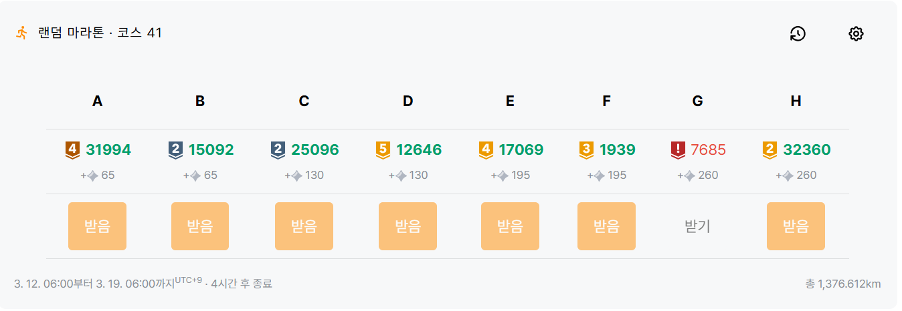

# solved\.ac 랜덤 마라톤 41주차

---

## A
### #31994 : 강당 대관
https://www.acmicpc.net/problem/31994

#### 해결 상태
✅

#### 난이도

#### 사용 알고리즘

**#구현**

#### 풀이
  
세미나의 신청자 수를 입력받아 가장 많은 신청자 수를 가진 세미나 명을 출력하는 문제.

1. 최대값을 저장할 `max`를 선언하고 0으로 초기화한다. 그리고 최대 신청자 수가 등록된 세미나 명을 저장할 문자열 `seminar`를 선언한다.
2. 아래 과정을 7번 반복한다.
    2-1. 세미나명과 신청자 수를 입력받는다.
    2-2. 신청자 수가 `max`보다 크다면 `max`에 신청자 수를, `seminar`에 세미나명을 저장한다.
3. 최종적으로 저장된 `seminar` 문자열을 출력한다.

#### 코멘트

간단한 반복문, 조건문을 이용하는 쉬운 구현 문제이다.
최댓값을 구하는 방법은 map과 정렬을 사용하는 등 다양한 방법이 있을 수 있지만 역시 그냥 입력값을 받을 때마다 현재 최댓값과 비교하는 방법이 가장 효율적이라고 생각한다.

---

## B
### #15092 : Sheba’s Amoebas
https://www.acmicpc.net/problem/15092

#### 해결 상태
✅

#### 난이도

#### 사용 알고리즘

**#그래프 이론**  
**#그래프 탐색**  
**#너비 우선 탐색**  
**#깊이 우선 탐색**  

#### 풀이

그리드 내에 묘사되어 있는 아메바 루프의 개수를 구하는 문제.

1. 배열 크기 `m`, `n`을 입력받고, 배열을 저장하기 위한 $m × n$ 크기의 bool 형식 2차원 벡터 `v`를 선언한다.
2. `m`개의 줄에 걸쳐 배열을 묘사하는 문자열을 입력받고, 문자열을 순회하여 2차원 벡터 `v`에 '#' 부분은 true로, '.' 부분은 false로 저장한다.
3. 아메바의 개수를 저장할 `cnt` 변수 선언 후 0으로 초기화한다.
4. 배열의 모든 원소를 순회($m × n$)하며 아메바 영역으로 묘사된 부분 true를 찾는다. 만약 true 값을 찾았다면 아래 과정과 같이 탐색하고, false 값이라면 계속 순회를 진행한다.
    - 4-1. 먼저 새로운 아메바 영역을 찾았으므로 `cnt` 값을 1 증가시킨다.
    - 4-2. DFS 또는 BFS를 이용하여 주변 8칸에 연결된 true 값을 찾으면서 연결되어 있는 모든 true 값을 false로 바꾼다. 즉, 이번에 찾은 아메바의 영역을 모두 제거한다. DFS를 이용한 자세한 과정은 아래와 같다.
        - 4-2-1. 2차원 벡터 정보와 현재 위치 정보를 매개변수로 보내 `dfs()` 함수를 호출한다. 
        - 4-2-2. `v` 벡터에서 현재 위치의 true 값을 false로 바꾼다.
        - 4-2-3. 현재 위치 주변 8칸의 `v` 벡터 원소를 체크한다.
            - case 1. 주변 8칸 중에서 true 값을 가진 모든 `v` 벡터 원소에 대해 해당 위치 값을 매개변수로 하여 4-2-1 과정을 재귀적으로 실행한다.
            - case 2. 더 이상 주변 8칸에 true 값을 가진 원소가 없다면 현재 실행된 `dfs()` 함수를 종료한다.
5. 최종적인 아메바 개수 `cnt` 값을 출력한다.

#### 코멘트

단순한 그래프 순회 플러드 필 문제이다.  
요즘 BFS만 사용한 것 같아서 오랜만에 DFS를 써봤다.  

그런데 이 문제, 저번에 내가 풀었던 문제와 완전히 똑같다!  

https://www.acmicpc.net/problem/16390

문제 제목, 지문, 그림, 예제가 토씨 하나 안 틀리고 똑같다.  
문제 출처를 살펴보니 둘 다 2017년 ICPC 북아메리카 지역 예선 대회에서 사용되었는데 북중부 지역과 중동부 지역에서 동일한 문제를 출제한 것으로 보인다.  
뭐 어찌됐든 간에 문제도 웰노운이고 문제도 저번에 풀어본 문제와 똑같았기 때문에 날먹날먹 신나는 날먹이었다.  

우연찮게 저 위의 16390번 풀이에서도 DFS를 사용했었는데 이번에 풀었을 때는 예전 풀이보다 메모리를 적게 사용했다.  
확인해보니 DFS 과정에서 배열 원소 유효성 검사를 예전 풀이에서는 재귀 함수를 호출하고 진행했었는데 이번 풀이에서는 재귀 함수를 호출하기 전에 원소 유효성 검사를 진행한다는 차이가 있었다.  
함수 호출은 자원을 많이 소모하기 때문에 불필요한 호출은 지양하고 함수 내용을 실행할 지 여부를 검사하는 작업은 함수 바깥에서 수행하는 것이 더 효율적일 것으로 생각된다.

---

## C
### #25096 : Pancake Deque
https://www.acmicpc.net/problem/25096

#### 해결 상태
✅

#### 난이도

#### 사용 알고리즘

**#자료 구조**  
**#그리디 알고리즘**  
**#덱**  

#### 풀이

덱에 저장된 팬케이크 중 양쪽 끝에 있는 팬케이크를 하나씩 대접하면서 가장 맛있는 팬케이크를 최대한 많이 대접할 수 있는 횟수를 구하는 문제.  
즉, 초기 최댓값을 0으로 잡고 덱의 양 끝 값 중 하나를 선택할 때 최댓값을 최대한 많이 갱신하는 문제이다.  

1. **테스트 케이스 횟수 `t`를 입력받아 `t` 만큼 아래 내용을 반복**한다.
    - 1-1. **팬케이크 개수 `n`을 입력받는다.**
    - 1-2. **`n` 크기의 배열 `pancakes`를 선언한 뒤** 덱에 저장된 **팬케이크의 '맛있음 수치'를 `pancakes`에 저장**한다.
    - 1-3. **덱의 양 끝 위치를 나타낼 `left`, `right` 변수를 선언하고 각각 $0$, $n - 1$로 초기화**한다. 그리고 **최댓값을 저장할 `max`와 값을 지불한 횟수(최댓값이 갱신된 횟수)를 저장할 `pay`를 선언하고 모두 $0$으로 초기화**한다.
    - 1-4. 아래 과정을 **`n`번 반복하며 덱(`pancakes` 배열)의 모든 값을 순회**한다.
        - 1-4-1. **덱의 양 끝(`pancakes[left]`, `pancakes[right]`) 값을 비교**한다.
            - case 1. **오른쪽 값(`pancakes[right]`)이 더 크다면** 최댓값 `max`와 왼쪽 값(`pancakes[left]`)을 비교한 후 **왼쪽 값이 `max`보다 크거나 같다면 `max` 값을 갱신하고 `pay` 값을 1 증가**한다. 이후 `max` 갱신 여부와 상관없이 **`left` 값을 1 증가**시켜 덱(`pancakes` 배열)의 왼쪽 방향 다음 원소를 가리키게 한다.
            - case 2. **왼쪽 값(`pancakes[left]`)이 더 작거나 같다면** 최댓값 `max`와 오른쪽 값(`pancakes[right]`)을 비교한 후 **오른쪽 값이 `max`보다 크거나 같다면 `max` 값을 갱신하고 `pay` 값을 1 증가**한다. 이후 `max` 갱신 여부와 상관없이 **`right` 값을 1 감소**시켜 덱(`pancakes` 배열)의 오른쪽 방향 다음 원소를 가리키게 한다.
    - 1-5. **이번 테스트 케이스의 번호와 `pay` 값을 출력**한다.

#### 코멘트

문제 내용과 풀이가 복잡해보이지만 생각보다 꽤 간단한 문제였다.  
최댓값과 같거나 큰 원소를 최대한 많이 마주치기 위해서는 최댓값을 최대한 작게 유지하는 것이 유리한데, 어차피 선택지가 왼쪽 끝과 오른쪽 끝 2개 밖에 존재하지 않는데다가 다음 원소들이 모두 선형적으로 나타나기 때문에 그리디하게 둘 중 더 작은 값을 계속 선택하면 된다.  
만약 두 값이 같은 값이더라도 아무 방향을 선택하여 원소를 없애다 보면 두 방향 중 어느 곳에서든지 더 큰 값이 나올 때 나머지 방향의 값을 마저 없애게 되므로 어느 방향을 선택하든 같은 결과를 얻을 수 있다.

문제에서 덱 자료구조를 언급하였는데 덱 원소를 추가하는 연산이 없고 삭제 연산만 수행하기 때문에 굳이 덱을 쓸 필요 없이 두 포인터 알고리즘처럼 양 끝의 배열 인덱스를 조정하는 방법으로 구현할 수 있었다.  
물론 덱 자료구조의 개념 정도는 알고 있어야 문제 풀이가 훨씬 수월하긴 할 것이다.

첫번째 코드 제출 후 정답은 떴는데 메모리 사용량이 높아서 확인해봤더니 메모리 해제 코드를 빠뜨린 것을 발견했다. 
이 경우 매 테스트 케이스마다 새로 동적 배열을 할당하는 과정에서 메모리 누수가 발생하여 사용 메모리가 폭발하게 된다.  
실수를 깨닫고 메모리 해제 코드를 집어넣었더니 메모리 폭발이 방지된 것과 더불어 C++ 실행시간 기준 전체 2등을 찍게 되었다. 
근데 내 코드의 실행 시간은 416ms인데 1등 실행 시간은 무려 32ms이다.  
불행히도 코드가 비공개 상태라 무슨 마법을 쓴 건지는 알 수 없다.  

---

## D
### #12646 : The Next Number (Large)
https://www.acmicpc.net/problem/12646

#### 해결 상태
✅

#### 난이도

#### 사용 알고리즘

**#구현**  
**#그리디 알고리즘**  

#### 풀이

주어진 수의 각 자리 숫자들을 조합한 수들 중에 주어진 수보다 큰 수들 중 가장 작은 수를 구하는 문제.

1. **테스트 케이스 횟수 `t`를 입력받아 아래 과정을 `t`번 반복**한다.
    - 1-1. **수를 입력받아 `num`에 저장**한다. 이 때, 수의 범위가 최대 $10^{20}$이므로 **문자열로 입력받는다.**
    - 1-2. **수를 순회할 인덱스 변수 `idx`를 선언하고 `num` 문자열의 마지막 인덱스 번호를 저장**한다. 
    그리고 **이전 자리 수를 저장할 정수형 변수 `last`를 선언하고 `num` 문자열의 마지막 문자를 저장**한다. (형변환을 해도 되지만 char 형식으로 저장된 숫자끼리 비교 연산을 수행해도 동일한 결과가 나오므로 형변환을 하지 않았다.)
    - 1-3. **순회한 자리의 숫자들을 저장할 정수 벡터 `poped`를 선언**한다.
    - 1-4. **`num`의 모든 자리 숫자를 순회하거나 직전 자리수 값(`last`)보다 이번 인덱스 자리 숫자(`num[idx]`)가 더 작아지기 전까지 `num`의 각 자리 숫자를 끝부분부터 순회**한다.
        - 1-4-1. **`num`의 이번 자리 숫자를 정수 값으로 바꿔 poped 벡터에 추가**한다.
        - 1-4-2. **`last`에 이번 자리 숫자를 저장하고 인덱스 `idx`를 1 감소**한다.
    - 1-5. 위 1-4 과정이 끝났다면 `poped` 벡터에는 숫자가 오름차순으로 저장되어 있으며 `num`에서 현재 `idx`에 해당하는 자리 숫자는 무조건 `poped`에서 가장 큰 값보다 작은 값을 나타내고 있을 것이다.  
    이제 출력을 위해 **이번 테스트 케이스 번호를 출력**한다.
    - case 1. 만약 **idx가 0 이상이라면** 순회가 중간에 중단되었다는 뜻이며 **아래 과정을 수행**한다.
        - case 1-1.**`num`에서 `idx`에 해당하는 자리 숫자를 정수 값으로 바꿔 `poped` 벡터에 추가적으로 넣어준 후, `val` 변수를 선언하여 해당 숫자를 저장**한다.
        - case 1-2. **`poped` 벡터를 오름차순 정렬**한다. 
        - case 1-3. **`second` 변수를 선언하고 `poped` 벡터를 순회하면서 `val` 값 다음으로 큰 값을 찾아 저장**한다.
        - case 1-4. 이제 **`poped`에 속하지 않은 `num`의 앞부분 숫자(`idx`보다 작은 인덱스 원소)들을 출력한 후**, 그 다음으로 **`second` 값을 출력**한다. (즉, `idx`에 해당하는 부분의 값을 그 다음으로 큰 값으로 대체하여 출력하게 된다.)
        - case 1-5. 이제 **`poped`에 남은 정렬된 값들을 출력**한다. **이 때, `second`로 사용된 값은 출력하지 않는다. `second` 값이 두 번 이상 나온다면 딱 한 번만 출력하지 않고 나머지 값은 출력**한다. (이미 `second`에 해당하는 값을 앞에서 출력했으므로 중복해서 출력하지 않기 위한 과정이다.)
    - case 2. 만약 **idx가 0보다 작다면** 순회가 모두 이루어졌다는 뜻으로, 현재 주어진 숫자 조합만으로는 더 이상 현재 값보다 큰 값이 없다는 의미이다. 따라서 현재 숫자 조합에 0을 추가하여 수를 출력할 것이다. 먼저 **`poped` 벡터 원소들을 오름차순 정렬 시킨 후 조건에 따라 아래 과정을 수행**한다.
        - case 2-A. 정렬된 **`poped` 벡터의 첫 번째 값이 0이 아니라면 해당 값을 가장 먼저 출력한 후, 뒤에 0을 출력한 다음 두 번째 값부터 `poped` 벡터의 모든 값을 순서대로 출력**한다.
        - case 2-B. 만약 **`poped` 벡터의 첫 번째 값이 0이라면** 위와 작업을 수행할 시 0으로 시작하는 수를 출력하게 된다. 이를 배제하기 위해 **아래 과정을 수행**한다. 
            - case 2-B-1. **맨 앞에 0 대신 출력할 숫자를 결정할 `v` 변수 선언 후 0으로 초기화**한다. 
            - case 2-B-2. **`poped` 벡터를 순회하면서 0 이외에 가장 작은 값을 찾아 `v`에 저장**한다.
            - case 2-B-3. **`v` 값을 가장 먼저 출력하고, 그 뒤에 0을 출력한 다음 `poped` 벡터의 모든 값을 순서대로 출력**한다. **이 때, `v`로 사용된 값은 출력하지 않는다. `v` 값이 두 번 이상 나온다면 딱 한 번만 출력하지 않고 나머지 값은 출력**한다. (이미 `v`에 해당하는 값을 앞에서 출력했으므로 중복해서 출력하지 않기 위한 과정이다.)
    - 1-6. 마지막으로 **출력에 줄바꿈을 수행**한다. 다음 테스트 케이스가 있다면 다음 테스트 케이스를 수행하기 위해 1-1 과정으로 되돌아간다.

#### 코멘트

골드 5 수준의 D번 문제 치고 체감상 매우 까다로웠던 문제이다.  
문제 알고리즘에는 그냥 구현이랑 그리디 밖에 없긴 한데 나는 순열을 구현하기 위해 정렬까지 써먹고 예외처리를 위해 if문을 떡칠한 좀 기괴한 풀이로 해결했다.  
다른 사람들의 풀이도 몇 개 봤는데 솔직히 이게 그리디인지는 잘 모르겠다.  

문제 자체만 보면 간단히 정렬된 순열 값중 다음 순열을 제시하는 문제이긴 한데 깡으로 구현하려니 생각보다 복잡해서 코드가 드러워졌다.  
기본적인 아이디어는 끝에서부터 순회하여 오름차순이 위배되는 위치를 찾은 뒤 해당 자리 수부터 시작하는 다음 순열을 찾으면 끝이긴 하다.  
다만 주어진 숫자가 마지막 순열일 경우 0을 포함한 새로운 순열을 만들어야 하는 예외 사항이 있고,  
거기서 또 0으로 시작되는 순열이 나타나는 경우를 방지하기 위한 예외 처리를 또 수행해야 하는 등 고려해야 할 부분이 많았던 문제이다.  
다른 사람들 코드를 보니 next_permuation() 이라는 내장 함수를 써서 그냥 다음 순열을 함수 딸깍으로 구해버리는 케이스가 많았다.  

처음 문제를 봤을 때는 주어진 수로 만들 수 있는 모든 조합을 조사해볼까 했지만 테스트 케이스 $T$가 최대 500이고 주어지는 수 $N$이 최대 $10^{20}$이기 때문에 시간복잡도가 $O(T × N!) = O(1,216,451,004,088,320,000,000)$이기 때문에 일찌감치 포기했다.

---

## E
### #17069 : 파이프 옮기기 2
https://www.acmicpc.net/problem/17069

#### 해결 상태
✅

#### 난이도

#### 사용 알고리즘

**#다이나믹 프로그래밍**  

#### 풀이

- 파이프를 주어진 조건에 맞게 왼쪽 끝에서 오른쪽 끝으로 이동시키는 경우의 수를 구하는 문제.

1. **집 크기 `n`을 입력**받는다.
2. **집을 묘사할 $(n + 1) × (n + 1)$ 크기 2차원 bool형 벡터 `house`를 선언**한다.
3. **(1, 1)부터 (n, n) 사이 좌표의 값을 입력받아 2차원 `house`에 저장**한다. (0이면 빈 공간, 1이면 벽을 의미한다.)
4. 각 위치에서 파이프 상태에 따라 가능한 **경우의 수를 누적하여 저장하기 위한 3차원 dp 배열 `cnt`를 $(n + 1) × (n + 1) × 3$ 크기로 선언하여 원소를 모두 0으로 초기화**한다.
> `cnt[i][j][0]`은 파이프 좌상단 끝이 (i, j)이고 가로로 배치된 상태(i, j + 1)  
> `cnt[i][j][1]`은 파이프 좌상단 끝이 (i, j)이고 세로로 배치된 상태(i + 1, j)  
> `cnt[i][j][2]`는 파이프 좌상단 끝이 (i, j)이고 대각선으로 배치된 상태(i, j + 1), (i + 1, j + 1), (i + 1, j)  
5. 초기 상태는 파이프 왼쪽 끝이 (1, 1)이고 가로로 배치된 상태이므로 **`cnt[1][1][0]`에 1을 넣는다.**
6. **(1, 1) 좌표부터 (n, n) 좌표까지 좌측 → 우측, 상단 → 하단 순서대로 순회하며** 아래와 같은 과정을 통해 **경우의 수를 구한다.** (파이프가 이동할 수 있는 방향은 우측 방향, 하단 방향, 우하단 방향 3가지 밖에 없기 때문에 순회 순서를 우측 방향 및 하단 방향으로만 만족하도록 제한하면 모든 경우의 수를 구할 수 있다.) 
    - 6-1 **현재 좌표(i, j)를 기준으로** 가로(`cnt[i][j][0]`) 상태, 세로 (`cnt[i][j][1]`) 상태, 대각선 (`cnt[i][j][2]`) 상태 각각을 체크하여 **파이프를 추가적으로 밀 수 있는지 검증**한다.
        - case 6-1. **현재 위치에서 파이프가 가로 상태가 가능한 경우가 있다면(`cnt[i][j][0]` $ > 0$), 아래 조건을 추가적으로 체크하여 경우의 수를 누적**한다.
            - case 6-1-A. **현재 상태에서 다음 위치에 가로 상태로 놓을 수 있는지 확인한 후, 다음 위치의 가로 상태에 해당하는 dp 배열 원소(`cnt[i][j + 1][0]`)에 현재 상태의 경우의 수 값을 누적하여 더한다.**
            - case 6-1-B. **현재 상태에서 다음 위치에 대각선 상태로 놓을 수 있는지 확인한 후, 다음 위치의 대각선 상태에 해당하는 dp 배열 원소(`cnt[i][j + 1][2]`)에 현재 상태의 경우의 수 값을 누적하여 더한다.**
        - case 6-2. **현재 위치에서 파이프가 세로 상태가 가능한 경우가 있다면(`cnt[i][j][1]` $ > 0$), 아래 조건을 추가적으로 체크하여 경우의 수를 누적**한다.
            - case 6-2-A. **현재 상태에서 다음 위치에 세로 상태로 놓을 수 있는지 확인한 후, 다음 위치의 세로 상태에 해당하는 dp 배열 원소(`cnt[i + 1][j][1]`)에 현재 상태의 경우의 수 값을 누적하여 더한다.**
            - case 6-2-B. **현재 상태에서 다음 위치에 대각선 상태로 놓을 수 있는지 확인한 후, 다음 위치의 대각선 상태에 해당하는 dp 배열 원소(`cnt[i + 1][j][2]`)에 현재 상태의 경우의 수 값을 누적하여 더한다.**
        - case 6-3. **현재 위치에서 파이프가 대각선 상태가 가능한 경우가 있다면(`cnt[i][j][0]` $ > 0$), 아래 조건을 추가적으로 체크하여 경우의 수를 누적**한다.
            - case 6-3-A. **현재 상태에서 다음 위치에 가로 상태로 놓을 수 있는지 확인한 후, 다음 위치의 가로 상태에 해당하는 dp 배열 원소(`cnt[i + 1][j + 1][0]`)에 현재 상태의 경우의 수 값을 누적하여 더한다.**
            - case 6-3-B. **현재 상태에서 다음 위치에 세로 상태로 놓을 수 있는지 확인한 후, 다음 위치의 세로 상태에 해당하는 dp 배열 원소(`cnt[i + 1][j + 1][1]`)에 현재 상태의 경우의 수 값을 누적하여 더한다.**
            - case 6-3-C. **현재 상태에서 다음 위치에 대각선 상태로 놓을 수 있는지 확인한 후, 다음 위치의 대각선 상태에 해당하는 dp 배열 원소(`cnt[i + 1][j + 1][2]`)에 현재 상태의 경우의 수 값을 누적하여 더한다.**
7. 파이프의 우하단 끝부분이 (n, n) 좌표에 위치할 수 있는 경우의 수는 파이프 좌상단이 (n, n - 1)이고 가로로 배치되어 있을 때(**cnt[n][n - 1][0]**), 파이프 좌상단이 (n - 1, n)이고 세로로 배치되어 있을 때(**cnt[n - 1][n][1]**), 파이프 좌상단이 (n - 1, n - 1)이고 대각선으로 배치되어 있을 때(**cnt[n - 1][n - 1][2]**)이므로 이 **값들을 모두 더한 값을 출력**한다.
        
#### 코멘트

좀 복잡해보이는 3차원 DP 문제이지만 구현량만 많지 점화식을 직관적으로 떠올리기 어렵지 않은 무난한 문제였다.  
  
오히려 DP 보다는 문제 조건에 따른 구현에 더 애를 먹었다.  
보통 파이프를 민다 하면 동그란 모양의 축과 직교하는 방향으로 미는 것이 연상되는데  
이 문제에서는 반대로 파이프 축과 평행한 방향으로 바닥을 긁어부수면서 밀라고 한다. 누가 파이프를 그렇게 밀어서 옮기는지?   

저 해괴한 조건 때문에 구현하는 내내 머릿속에서 `?`가 떠나간 적이 없다.  
막말로 DP 점화식보다 파이프를 미는 조건이 더 비직관적이었다고 느꼈다.  

---

## F
### #1939 : 중량제한
https://www.acmicpc.net/problem/1939

#### 해결 상태
✅

#### 난이도

#### 사용 알고리즘

**#자료 구조**  
**#그래프 이론**  
**#그래프 탐색**  
#이분 탐색  
#너비 우선 탐색  
**#최단 경로**  
#분리 집합  
  
**#데이크스트라**

#### 풀이

시작 섬에서 목표 섬까지 갈 수 있는 경로 중에서 지나는 다리들의 중량제한을 최대화하는 문제.  
매우 다양한 풀이가 있지만 다익스트라 알고리즘을 응용한 풀이는 아래와 같다.  

1. **섬의 개수 `n`, 다리의 개수 `m`을 입력받은 뒤, 각 다리의 정보(연결하는 두 섬의 번호와 다리의 중량제한)를 2차원 벡터 `bridges`에 저장**한다. (bridegs[i]에는 i번째 섬에 이어진 각 다리의 행선지(j)와 다리 허용 중량(k)가 {j, k} 쌍 여러개가 저장된 벡터가 저장된다.)
2. **시작 지점 `s`와 목표 지점 `e`를 입력받는다.**
3. **시작 지점에서 각 섬까지 갈 수 있는 최대 허용 중량을 저장할 $n + 1$ 크기의 벡터 `max`를 선언하고 모든 값을 0으로 초기화**한다.
4. **다익스트라 알고리즘을 수행하기 위한 {정수, 정수} 쌍의 우선순위 큐 `pq`를 선언**한다. (저장된 정수 쌍 중 첫 번째 정수가 큰 값이 큐의 앞에 오도록 우선순위를 지정한다. 즉, 따로 비교 함수를 설정할 필요는 없다. 정수 쌍 중 두 번째 정수 값은 어느 값이 먼저 와도 상관없다.)
5. 먼저 시작 지점을 세팅한다. **시작 지점에 갈 수 있는 허용 중량(`max[s]`)에 최대한 큰 값을 저장**하고, (각 다리의 중량제한 $C$의 최대 범위가 1000000000이므로, 1000000000 이상의 값을 저장하면 된다.) **우선순위 큐 `pq`에 {최대한 큰 값{1000000000}, {시작 지점 인덱스(`s`)}}를 추가**한다.
6. **우선순위 큐 `pq`가 빌 때까지 아래 작업을 반복**한다.
    - 6-1. **현재 우선순위 큐 `pq`에 저장된 정수 쌍 중 가장 앞에 있는 정수 쌍**(첫 번째 정수가 가장 큰 정수 쌍)**의 첫 번째 정수()를 `noww` 변수에 저장하고, 두 번째 정수를 `nowp` 정수에 저장**한다. 그 다음, **해당 정수 쌍을 `pq`에서 제거**한다.
    - 6-2. `nowp`는 섬의 번호, `noww`는 `pq`에 입력된 시점에서 `nowp` 번호 섬까지 갈 수 있는 최대 중량을 의미한다. 만약 `noww` 최대 중량이 `max` 배열에 저장된 `nowp` 번호 섬의 최대 중량보다 작거나 같다면 이전에 `nowp`번 섬에서 `noww` 이상의 중량으로 갈 수 있는 모든 경로를 확인했다는 뜻이므로 탐색을 중단하고 `pq`의 다음 원소를 탐색하기 위해 6번 과정으로 돌아간다. 만약 **`noww` 최대 중량이 `max` 배열에 저장된 `nowp` 번호 섬의 최대 중량보다 크다면** `nowp`에서 기존 중량을 초과할 수 있는 새 경로를 탐색하기 위해 **아래 6-2-1 과정을 시작**한다.
        - 6-2-1. **`nowp`와 연결되어 있는 다리들(`bridges[nowp]`)을 순회하며 각 다리에 대해 아래 과정을 수행**한다. (이번에 순회하는 `i`번째 다리(`bridges[nowp][i]`)를 간단하게 `b`로 정의하겠다.)
            - 6-2-1-1. **`nowp`번 섬에 도달 가능한 최대 중량 `noww`과 이번 순회 다리 `b`의 중량제한 `b.second` 중 작은 값을 `bw` 변수에 저장**한다.
            - 6-2-1-2. **이번 순회 다리 `b`와 이어져 있는 반대편 섬 `b.first`에 도달할 수 있는 허용 중량의 기존 값(`max[b.first]`)보다 이번 경로를 통해 갈 수 있는 최대 중량(`bw`)이 더 크다면, `max[b.first]` 배열 값을 `bw`로 갱신하고, `b.first` 섬에서 새로운 허용 중량으로 도달 할 수 있는 새 경로를 찾기 위해 우선순위 큐 `pq`에 {새 허용중량(`bw`), 다리 반대편 섬 번호(`b.first`)} 정수 쌍을 추가**한다.
7. 6번 과정이 끝나면 `max` 배열 각 인덱스(섬 번호)에는 각각의 섬에 도달할 수 있는 최대 중량이 저장된다. 이제 **e번 섬에 도달할 수 있는 최대 중량(`max[e]`)를 출력**한다.

#### 코멘트

오랜만에 풀게 된 다익스트라 최단 경로 문제이다.  
다익스트라 알고리즘이 슬슬 가물가물해지려 했는데 리마인드 복습 겸 천천히 풀어봤더니 의외로 깔끔해게 잘 풀렸다.  
그런데 가중치를 최소로 하는 기존 최단 경로 문제들과 다르게,  
이번 문제는 가중치를 최대로 하는 경로를 구해야 하는 변형된 방식의 다익스트라 문제이다.  
뭐 그렇다고 대단한 스킬을 요하는 건 아니고, 그냥 우선순위 큐의 우선순위 설정과 경로를 갱신하는 조건 몇 가지를 조정하기만 하면 기본 다익스트라 풀이 과정과 크게 다르지는 않은 것 같다.  
  
알고리즘 태그에 다익스트라는 없고 BFS니 이분탐색이니 분리집합이니 온갖 알고리즘들이 튀어나와있어서 찾아봤더니 다익스트라 외에도 풀이 방법이 굉장히 다양한 것 같다.  
처음에는 단순 BFS로 해결해보려다가 로직이 이상한 것 같아서 포기했는데, BFS에 이분탐색을 섞어주면 풀린다는 것 같다.  
  
이 문제는 옛날에 풀다가 실패한 문제와 거의 유사하다.  
https://www.acmicpc.net/problem/13905  
당시에도 다익스트라를 이용하여 풀려다가 시간 초과가 떠서 실패했는데, 지금 다시 코드를 검증해보니 우선순위 큐의 우선순위 설정을 똑바로 안 해 놨었다.  
과거 다익스트라 알고리즘을 처음 배울 때 많이 저질렀던 우선순위 큐 설정 미스를 또 반복한 것이다.  
인간은 늘 같은 실수를 반복한다. 멍멍! 왈왈!  

---

## G
### #7685 : Nim
https://www.acmicpc.net/problem/7685

#### 해결 상태
❌

#### 난이도

#### 사용 알고리즘

#### 풀이

#### 코멘트

모든 돌 무더기들을 순회하면서 각 비트 자리 중 1인 비트가 홀수 개 있는 자리를 파악한 뒤,  
다시 돌 무더기들을 순회하면서 1비트가 홀수 개 있는 자리들이 모두 1비트인 돌 무더기의 개수를 구하는 방식으로 해결하려 하으나 통과하지 못했다.  

자체적으로 테스트 케이스들을 만들어서 검증해봤는데 반례를 못 찾았다.  
생각지도 못한 반례가 있거나 아니면 문제 자체를 잘못 이해했거나 비트마스킹을 잘못 설정했거나 등등..
변수가 너무 많아서 포기하고 GG 선언했다.

아예 발상 자체가 엄두를 못 내겠을 문제도 아니고    
분명 맞게 푼 것 같은데 알 수 없는 이유로 오답 판정을 받으니 성질이 뻗친다.

---

## H

### #32360 : 더워! 
https://www.acmicpc.net/problem/32360

#### 해결 상태
✅

#### 난이도

#### 사용 알고리즘

**#그래프 이론**  
**#그래프 탐색**  
**#너비 우선 탐색**  

#### 풀이

출발지에서 목적지까지 이동하면서 증가하는 불쾌감을 실내공간을 통해 적절히 조절하면서 목적지까지 걸리는 시간을 최소화하는 문제  

1. **격자판 크기 `n`, `m`과 실내 감소 불쾌감 `k`, 실외 증가 불쾌감 `c`를 입력받는다.**
2. **시작 지점(집) 위치를 저장할 `si`, `sj` 변수와 도착 지점(약속 장소) 위치를 저장할 변수 `ei`, `ej`를 선언**한다.
3. **거리 상태를 나타내는 `m` 길이 문자열 `n`개를 입력받아 문자열 벡터 `grid`에 저장**한다. 문자열을 입력받으면서 **출발지 위치 인덱스와 도착지 위치 인덱스를 `si`, `sj`, `ei`, `ej` 변수에 저장**한다.
4. **현재 시점에서 각 위치에서의 최소 불쾌감을 저장할 $N × M$ 크기의 2차원 배열 `dp`를 선언하고 모든 값을 100으로 초기화**한다. (불쾌감의 최댓값이 100이며, 100 이상의 값이 되면 더 이상 이동이 불가능하기 때문)
5. **현재 경과한 시간을 나타낼 `elapsed` 변수를 선언하고 0으로 초기화**한다.
6. **BFS를 수행하기 위한 정수 3개를 저장하는 큐 `q`를 선언**한다. 이 큐에 들어가는 3개의 정수는 {행 인덱스, 열 인덱스, 이전 시점의 불쾌감}이다. 최소 불쾌감이 갱신된 위치값과 해당 불쾌감을 저장하게 될 것이다.
7. 먼저 **출발점에 해당하는 `dp` 원소의 불쾌감을 0으로 설정하고, 큐에 시작점 위치와 0을 추가**한다.
8. **도착지점에 도달하는 경로를 찾지 못했는지 여부를 판단하는 bool 변수 `notfound`를 선언하고 true로 초기화**한다.
9. **도착 지점을 찾지 못하였고 큐 `q`에 데이터가 남아있다면 아래 과정을 반복**한다.
    - 9-1. **경과한 시간 `elapsed`를 1 증가**한다.
    - 9-2. **큐 `q`에 {-1, -1, -1} 데이터를 추가**한다. 이 데이터는 이전 시점에 갱신된 데이터와 현재 시점에 갱신된 데이터를 구분하는 역할을 한다.
    - 9-3. **큐에 -1 데이터가 나오기 전까지 아래 과정을 통해 BFS를 수행하면서 최소 불쾌감을 갱신하는 과정을 반복**한다.
        - 9-3-1. **큐의 맨 앞 데이터를 뽑아 행 인덱스를 `nowi`, 열 인덱스를 `nowj`, 이전 시점에서 갱신된 불쾌감 수치를 `value`에 저장하고, 해당 데이터를 큐에서 제거**한다.
        - 9-3-2. 만약 **불쾌감 `value`가 0이 아니고 현재 위치가 실내라면, 아래 과정을 통해 현재 위치의 최소 불쾌감 갱신을 시도**한다.
            - 9-3-2-1. **`newvalue` 변수에 max(0, `value` - `k`) 값을 저장**한다.
            - 9-3-2-2. **`dp` 배열의 현재 위치 불쾌감이 `newvalue`보다 크다면 `dp` 배열 현재 위치 값을 갱신하고, 큐에 현재 위치와 `newvalue` 값을 추가**한다.
        - 9-3-3. 만약 **현재 위치에서 상단 위치로 이동할 수 있다면**, 아래 과정을 통해 상단 위치의 최소 불쾌감 갱신을 시도한다.  
            - case 1. 만약 **상단 위치가 실내라면, `newvalue` 변수에 max(0, `value` - `k`) 값을 저장한 후, `dp` 배열의 상단 위치 불쾌감이 `newvalue`보다 크다면 `dp` 배열의 상단 위치 값을 갱신하고, 큐에 상단 위치와 `newvalue` 값을 추가**한다.
            - case 2. 만약 **상단 위치가 실외라면, `dp` 배열의 상단 위치 불쾌감이 `value` + `c` 값보다 크다면 `dp` 배열의 상단 위치 불쾌감을 해당 값으로 갱신하고, 큐에 상단 위치와 갱신된 불쾌감 값을 추가**한다.
        - 9-3-4. 만약 **현재 위치에서 하단 위치로 이동할 수 있다면**, 아래 과정을 통해 하단 위치의 최소 불쾌감 갱신을 시도한다.  
            - case 1. 만약 **하단 위치가 실내라면, `newvalue` 변수에 max(0, `value` - `k`) 값을 저장한 후, `dp` 배열의 하단 위치 불쾌감이 `newvalue`보다 크다면 `dp` 배열의 하단 위치 값을 갱신하고, 큐에 하단 위치와 `newvalue` 값을 추가**한다.
            - case 2. 만약 **하단 위치가 실외라면, `dp` 배열의 하단 위치 불쾌감이 `value` + `c` 값보다 크다면 `dp` 배열의 하단 위치 불쾌감을 해당 값으로 갱신하고, 큐에 하단 위치와 갱신된 불쾌감 값을 추가한**다.
        - 9-3-5. 만약 **현재 위치에서 좌측 위치로 이동할 수 있다면**, 아래 과정을 통해 좌측 위치의 최소 불쾌감 갱신을 시도한다.  
            - case 1. 만약 **좌측 위치가 실내라면, `newvalue` 변수에 max(0, `value` - `k`) 값을 저장한 후, `dp` 배열의 좌측 위치 불쾌감이 `newvalue`보다 크다면 `dp` 배열의 좌측 위치 값을 갱신하고, 큐에 좌측 위치와 `newvalue` 값을 추가**한다.
            - case 2. 만약 **좌측 위치가 실외라면, `dp` 배열의 좌측 위치 불쾌감이 `value` + `c` 값보다 크다면 `dp` 배열의 좌측 위치 불쾌감을 해당 값으로 갱신하고, 큐에 좌측 위치와 갱신된 불쾌감 값을 추가**한다.
        - 9-3-6. 만약 **현재 위치에서 우측 위치로 이동할 수 있다면**, 아래 과정을 통해 우측 위치의 최소 불쾌감 갱신을 시도한다.  
            - case 1. 만약 **우측 위치가 실내라면, `newvalue` 변수에 max(0, `value` - `k`) 값을 저장한 후, `dp` 배열의 우측 위치 불쾌감이 `newvalue`보다 크다면 `dp` 배열의 우측 위치 값을 갱신하고, 큐에 우측 위치와 `newvalue` 값을 추가**한다.
            - case 2. 만약 **우측 위치가 실외라면, `dp` 배열의 우측 위치 불쾌감이 `value` + `c` 값보다 크다면 `dp` 배열의 우측 위치 불쾌감을 해당 값으로 갱신하고, 큐에 우측 위치와 갱신된 불쾌감 값을 추가**한다.
        - 9-3-7. 도착 지점의 `dp` 배열 값을 확인하여 **도착점 불쾌감 값이 100 미만의 값으로 갱신되었다면** 경로를 찾았다는 표시로 **`notfound` 값을 false로 바꿔준 후 BFS를 중단**한다.
    - 9-4. **큐에 -1 데이터가 나와 갱신이 종료되었다면(이전 시점에서 갱신된 값들을 통해 이번 시점 갱신이 끝났다면) -1 데이터를 큐에서 제거**한다. 그리고 이 시점에서 **도착지점까지의 경로를 찾았거나(`notfound` == false) 또는 큐에 남아있는 데이터(더 이상 갱신된 불쾌감이 없다면) 반복문을 빠져나온다.**
10. **`notfound`가 false라면** 경로를 찾았다는 뜻이므로 경과 시간 **`elapsed`를 출력**하고, **`notfound`가 true라면** 더 이상 불쾌감을 줄이지 못하는 상태에서 갈 수 있는 경로가 없다는 뜻이므로 **-1을 출력**한다.

##### 풀이 부록
핵심은 현재 시점에서 각 위치에서의 가능한 가장 낮은 불쾌감 수치를 찾는 것이다.  
불쾌감을 낮추지 않고 목적지에 도달할 수 없는 경로라면 BFS 과정에서 불쾌감이 100을 달성하게 되어 탐색이 중단되지만, 불쾌감을 적절하게 낮추게 된다면 탐색할 수 있는 BFS 범위가 더 넓어진다.  
결과적으로, 시간이 진행될수록 DP 배열 안의 불쾌감 수치들은 전체적으로 감소하면서 갈 수 있는 범위가 넓어지게 되고, 어느 시점에서 도착 지점의 불쾌감이 100에서 감소했다는 것은 그 시점에서 해당 불쾌감으로 목적지에 도달했다는 것을 의미하게 된다.  
만약 도착 지점의 불쾌감이 100에서 감소하지 않고 탐색이 중단되었다면 불쾌감을 갱신할 수 있는 모든 경우를 탐색하였지만 도착지점까지 100 미만의 불쾌감으로 도달하는데 실패했다는 의미가 된다.  

#### 코멘트 

문제를 처음 보고 며칠 간 감을 전혀 잡지 못했었는데  
저번처럼 카페에 앉아서 뇌비우고 1시간 동안 현대미술을 그리며 시뮬레이션을 하다가 실마리를 찾게 되었다.  
그 시뮬레이션 결과를 32360.pdf 파일에 기록해놨다. 솔직히 위에 적어놓은 풀이는 너무 장황해서 pdf의 그림을 참고해야 이해가 쏙쏙 될 것 같다.  
역시 문제풀이건 프로젝트건 코드 치기 전에 그림을 그리며 설계를 제대로 해야 감을 잡기가 쉽다.  

다른 사람들 후기를 봤는데 3차원 배열을 써서 푼 사람이 대부분인 것 같다.  
불쾌감이 최대 100이기 때문에 불쾌감을 또다른 차원 축으로 설정해서 3차원으로 BFS를 한다는 발상이다.  
사실 나도 행, 열, 불쾌감 제한을 보고 $100 \times 100 \times 100$ 크기 배열도 가능할 것이라는 생각은 했는데  
시뮬레이션을 돌리다가 2차원으로 DP스럽게 풀 수 있을 것 같아서 DP에 가깝게 푸는 쪽으로 가닥을 잡았다.  
그 때문인지는 모르겠지만 실행 시간, 메모리 소모량 기준으로 전체 2등, C++ 1등을 찍었다.  
  

  
첫 제출에서 오답 판정을 받았는데 현재 위치가 실내일 때 큐의 값에서 K를 빼지 않고 dp 배열 값에서 K를 빼는 실수를 저질러서 불쾌감이 중복으로 줄었던 것이 원인이었다.  
틀린 이유 찾느라 밤 샐뻔 했다.

---

## 결과 및 후기

| A | B | C | D | E | F | G | H |
|---|---|---|---|---|---|---|---|
| ✅ | ✅ | ✅ | ✅ | ✅ | ✅ | ❌ | ✅ |

> 체감 난이도 : **A < C ≤ B < E < D ≤ F < H ≤ G**

비트마스킹(으로 강하게 추정되는) 문제인 G번 빼고 다 해결했다.  
G번도 뭔가 풀 수 있을 것 같았는데 반례를 찾지 못하여 결국 포기한 문제이다.  
나중에 비트마스킹이 익숙해진 후 다시 보면 풀리지 않을까?  

2차원 그리드 및 그래프 활용 문제가 유독 많이 나와서 뭔가 문제 풀이가 비슷비슷했던 느낌이다. 다만 그 대가로 막대한 코드 구현량과 디버깅 지옥에 시달려야 했다.  

B번이랑 F번은 이전에 풀어봤던 문제와 거의 똑같은 문제여서 어렵지 않게 풀 수 있었다. 특히 F번은 5개월 전에 실패했던 랜덤 마라톤 문제였는데 이번에 코드를 다시 짜면서 오류의 원인을 찾아내어 5개월 짜리 체증 하나가 내려갔다.  
꺼-억