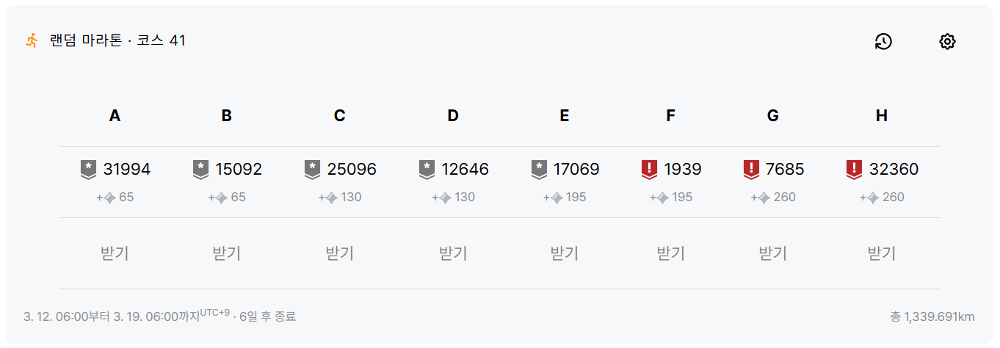

# solved\.ac 랜덤 마라톤 41주차

---

## A
### #31994 : 강당 대관
https://www.acmicpc.net/problem/31994

#### 해결 상태
✅

#### 난이도

#### 사용 알고리즘

**#구현**

#### 풀이
  
세미나의 신청자 수를 입력받아 가장 많은 신청자 수를 가진 세미나 명을 출력하는 문제.

1. 최대값을 저장할 `max`를 선언하고 0으로 초기화한다. 그리고 최대 신청자 수가 등록된 세미나 명을 저장할 문자열 `seminar`를 선언한다.
2. 아래 과정을 7번 반복한다.
    2-1. 세미나명과 신청자 수를 입력받는다.
    2-2. 신청자 수가 `max`보다 크다면 `max`에 신청자 수를, `seminar`에 세미나명을 저장한다.
3. 최종적으로 저장된 `seminar` 문자열을 출력한다.

#### 코멘트

간단한 반복문, 조건문을 이용하는 쉬운 구현 문제이다.
최댓값을 구하는 방법은 map과 정렬을 사용하는 등 다양한 방법이 있을 수 있지만 역시 그냥 입력값을 받을 때마다 현재 최댓값과 비교하는 방법이 가장 효율적이라고 생각한다.

---

## B
### #15092 : Sheba’s Amoebas
https://www.acmicpc.net/problem/15092

#### 해결 상태
✅

#### 난이도

#### 사용 알고리즘

**#그래프 이론**  
**#그래프 탐색**  
**#너비 우선 탐색**  
**#깊이 우선 탐색**  

#### 풀이

그리드 내에 묘사되어 있는 아메바 루프의 개수를 구하는 문제.

1. 배열 크기 `m`, `n`을 입력받고, 배열을 저장하기 위한 $m × n$ 크기의 bool 형식 2차원 벡터 `v`를 선언한다.
2. `m`개의 줄에 걸쳐 배열을 묘사하는 문자열을 입력받고, 문자열을 순회하여 2차원 벡터 `v`에 '#' 부분은 true로, '.' 부분은 false로 저장한다.
3. 아메바의 개수를 저장할 `cnt` 변수 선언 후 0으로 초기화한다.
4. 배열의 모든 원소를 순회($m × n$)하며 아메바 영역으로 묘사된 부분 true를 찾는다. 만약 true 값을 찾았다면 아래 과정과 같이 탐색하고, false 값이라면 계속 순회를 진행한다.
    - 4-1. 먼저 새로운 아메바 영역을 찾았으므로 `cnt` 값을 1 증가시킨다.
    - 4-2. DFS 또는 BFS를 이용하여 주변 8칸에 연결된 true 값을 찾으면서 연결되어 있는 모든 true 값을 false로 바꾼다. 즉, 이번에 찾은 아메바의 영역을 모두 제거한다. DFS를 이용한 자세한 과정은 아래와 같다.
        - 4-2-1. 2차원 벡터 정보와 현재 위치 정보를 매개변수로 보내 `dfs()` 함수를 호출한다. 
        - 4-2-2. `v` 벡터에서 현재 위치의 true 값을 false로 바꾼다.
        - 4-2-3. 현재 위치 주변 8칸의 `v` 벡터 원소를 체크한다.
            - case 1. 주변 8칸 중에서 true 값을 가진 모든 `v` 벡터 원소에 대해 해당 위치 값을 매개변수로 하여 4-2-1 과정을 재귀적으로 실행한다.
            - case 2. 더 이상 주변 8칸에 true 값을 가진 원소가 없다면 현재 실행된 `dfs()` 함수를 종료한다.
5. 최종적인 아메바 개수 `cnt` 값을 출력한다.

#### 코멘트

단순한 그래프 순회 플러드 필 문제이다.  
요즘 BFS만 사용한 것 같아서 오랜만에 DFS를 써봤다.  

그런데 이 문제, 저번에 내가 풀었던 문제와 완전히 똑같다!  

https://www.acmicpc.net/problem/16390

문제 제목, 지문, 그림, 예제가 토씨 하나 안 틀리고 똑같다.  
문제 출처를 살펴보니 둘 다 2017년 ICPC 북아메리카 지역 예선 대회에서 사용되었는데 북중부 지역과 중동부 지역에서 동일한 문제를 출제한 것으로 보인다.  
뭐 어찌됐든 간에 문제도 웰노운이고 문제도 저번에 풀어본 문제와 똑같았기 때문에 날먹날먹 신나는 날먹이었다.  

우연찮게 저 위의 16390번 풀이에서도 DFS를 사용했었는데 이번에 풀었을 때는 예전 풀이보다 메모리를 적게 사용했다.  
확인해보니 DFS 과정에서 배열 원소 유효성 검사를 예전 풀이에서는 재귀 함수를 호출하고 진행했었는데 이번 풀이에서는 재귀 함수를 호출하기 전에 원소 유효성 검사를 진행한다는 차이가 있었다.  
함수 호출은 자원을 많이 소모하기 때문에 불필요한 호출은 지양하고 함수 내용을 실행할 지 여부를 검사하는 작업은 함수 바깥에서 수행하는 것이 더 효율적일 것으로 생각된다.

---

## C
### #25096 : Pancake Deque
https://www.acmicpc.net/problem/25096

#### 해결 상태
✅

#### 난이도

#### 사용 알고리즘

**#자료 구조**  
**#그리디 알고리즘**  
**#덱**  

#### 풀이

덱에 저장된 팬케이크 중 양쪽 끝에 있는 팬케이크를 하나씩 대접하면서 가장 맛있는 팬케이크를 최대한 많이 대접할 수 있는 횟수를 구하는 문제.  
즉, 초기 최댓값을 0으로 잡고 덱의 양 끝 값 중 하나를 선택할 때 최댓값을 최대한 많이 갱신하는 문제이다.  

1. **테스트 케이스 횟수 `t`를 입력받아 `t` 만큼 아래 내용을 반복**한다.
    - 1-1. **팬케이크 개수 `n`을 입력받는다.**
    - 1-2. **`n` 크기의 배열 `pancakes`를 선언한 뒤** 덱에 저장된 **팬케이크의 '맛있음 수치'를 `pancakes`에 저장**한다.
    - 1-3. **덱의 양 끝 위치를 나타낼 `left`, `right` 변수를 선언하고 각각 $0$, $n - 1$로 초기화**한다. 그리고 **최댓값을 저장할 `max`와 값을 지불한 횟수(최댓값이 갱신된 횟수)를 저장할 `pay`를 선언하고 모두 $0$으로 초기화**한다.
    - 1-4. 아래 과정을 **`n`번 반복하며 덱(`pancakes` 배열)의 모든 값을 순회**한다.
        - 1-4-1. **덱의 양 끝(`pancakes[left]`, `pancakes[right]`) 값을 비교**한다.
            - case 1. **오른쪽 값(`pancakes[right]`)이 더 크다면** 최댓값 `max`와 왼쪽 값(`pancakes[left]`)을 비교한 후 **왼쪽 값이 `max`보다 크거나 같다면 `max` 값을 갱신하고 `pay` 값을 1 증가**한다. 이후 `max` 갱신 여부와 상관없이 **`left` 값을 1 증가**시켜 덱(`pancakes` 배열)의 왼쪽 방향 다음 원소를 가리키게 한다.
            - case 2. **왼쪽 값(`pancakes[left]`)이 더 작거나 같다면** 최댓값 `max`와 오른쪽 값(`pancakes[right]`)을 비교한 후 **오른쪽 값이 `max`보다 크거나 같다면 `max` 값을 갱신하고 `pay` 값을 1 증가**한다. 이후 `max` 갱신 여부와 상관없이 **`right` 값을 1 감소**시켜 덱(`pancakes` 배열)의 오른쪽 방향 다음 원소를 가리키게 한다.
    - 1-5. **이번 테스트 케이스의 번호와 `pay` 값을 출력**한다.

#### 코멘트

문제 내용과 풀이가 복잡해보이지만 생각보다 꽤 간단한 문제였다.  
최댓값과 같거나 큰 원소를 최대한 많이 마주치기 위해서는 최댓값을 최대한 작게 유지하는 것이 유리한데, 어차피 선택지가 왼쪽 끝과 오른쪽 끝 2개 밖에 존재하지 않는데다가 다음 원소들이 모두 선형적으로 나타나기 때문에 그리디하게 둘 중 더 작은 값을 계속 선택하면 된다.  
만약 두 값이 같은 값이더라도 아무 방향을 선택하여 원소를 없애다 보면 두 방향 중 어느 곳에서든지 더 큰 값이 나올 때 나머지 방향의 값을 마저 없애게 되므로 어느 방향을 선택하든 같은 결과를 얻을 수 있다.

문제에서 덱 자료구조를 언급하였는데 덱 원소를 추가하는 연산이 없고 삭제 연산만 수행하기 때문에 굳이 덱을 쓸 필요 없이 두 포인터 알고리즘처럼 양 끝의 배열 인덱스를 조정하는 방법으로 구현할 수 있었다.  
물론 덱 자료구조의 개념 정도는 알고 있어야 문제 풀이가 훨씬 수월하긴 할 것이다.

첫번째 코드 제출 후 정답은 떴는데 메모리 사용량이 높아서 확인해봤더니 메모리 해제 코드를 빠뜨린 것을 발견했다. 
이 경우 매 테스트 케이스마다 새로 동적 배열을 할당하는 과정에서 메모리 누수가 발생하여 사용 메모리가 폭발하게 된다.  
실수를 깨닫고 메모리 해제 코드를 집어넣었더니 메모리 폭발이 방지된 것과 더불어 C++ 실행시간 기준 전체 2등을 찍게 되었다. 
근데 내 코드의 실행 시간은 416ms인데 1등 실행 시간은 무려 32ms이다.  
불행히도 코드가 비공개 상태라 무슨 마법을 쓴 건지는 알 수 없다.  

---

## D
### #12646 : The Next Number (Large)
https://www.acmicpc.net/problem/12646

#### 해결 상태
❌

#### 난이도

#### 사용 알고리즘

#### 풀이

#### 코멘트

---

## E
### #17069 : 파이프 옮기기 2
https://www.acmicpc.net/problem/17069

#### 해결 상태
❌

#### 난이도

#### 사용 알고리즘

#### 풀이

        
#### 코멘트

---

## F
### #1939 : 중량제한
https://www.acmicpc.net/problem/1939

#### 해결 상태
❌

#### 난이도

#### 사용 알고리즘

#### 풀이

#### 코멘트

---

## G
### #7685 : Nim
https://www.acmicpc.net/problem/7685

#### 해결 상태
❌

#### 난이도

#### 사용 알고리즘

#### 풀이

#### 코멘트

---

## H

### #32360 : 더워! 
https://www.acmicpc.net/problem/32360

#### 해결 상태
❌

#### 난이도

#### 사용 알고리즘

#### 풀이

#### 코멘트 

---

## 결과 및 후기

| A | B | C | D | E | F | G | H |
|---|---|---|---|---|---|---|---|
| ✅ | ✅ | ❌ | ❌ | ❌ | ❌ | ❌ | ❌ |

