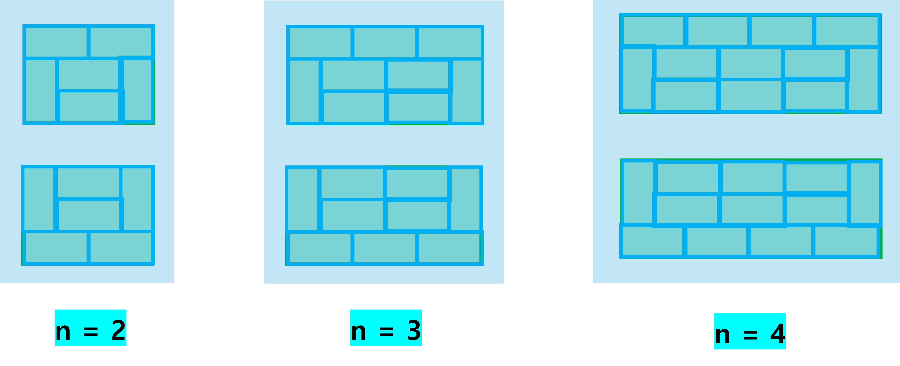

# solved\.ac 랜덤 마라톤 42주차

---

## A
### #24079 : 移動 (Moving)
https://www.acmicpc.net/problem/24079

#### 해결 상태
✅

#### 난이도

#### 사용 알고리즘

**#수학**  
**#사칙연산**  

#### 풀이

A 지점에서 B 지점까지의 소요시간과 B 지점에서 C 지점까지의 소요시간이 주어졌을 때 A 지점에서 B 지점을 거쳐 C 지점을 가는데 걸리는 소요시간이 Z시간 30분보다 작은지 판정하는 문제.

1. A 지점에서 B 지점까지의 소요시간 `x`, B 지점에서 C 지점까지의 소요시간 `y`, 비교할 시간 `z`를 입력받는다.
2. `x` + `y`의 값이 `z`보다 작다면 `0`을 출력하고, `x` + `y`의 값이 `z`보다 크거나 같다면 `1`을 출력한다.

#### 코멘트

단순한 덧셈 연산 후 조건식을 비교하는 사칙연산 문제이다. 브론즈4보다는 브론즈5에 더 가까운 수준의 난이도가 아닌가 싶다.  
  
뜬금없이 일본어 문제가 출몰해서 확인해봤더니 추천 받는 문제가 '일정 수듄' 이상이라며 더 이상 언어 편식을 못하게 막아놨다.  

  
뭐야 내 영어 및 한국어 문제 돌려줘요  

---

## B
### #27482 : Block Adventure
https://www.acmicpc.net/problem/27482

#### 해결 상태
✅

#### 난이도

#### 사용 알고리즘

**#그리디 알고리즘**  

#### 풀이

일렬로 각기 다른 높이를 가진 블록 탑을 차례대로 오르내리며 여분의 블록을 저장하고 꺼내는 과정을 통해 마지막 블록 탑에 도달할 수 있는지 파악하는 문제.

1. **테스트 케이스 개수 `t`를 입력받아 아래 과정을 `t`번 반복**한다.
    - 1-1. **블록 탑 개수 `n`, 초기 여분 블록 `m`, 넘을 수 있는 블록 높이 `k` 변수를 선언하여 입력받는다.**
    - 1-2. **블록을 넘을 수 있는지 여부를 판정할 bool 변수 `valid`를 선언하고 true로 초기화**한다.
    - 1-3. **`prev` 변수를 선언한 후 첫 번째 블록 탑의 높이를 입력받아 저장**한다.
    - 1-4. **두 번째 탑부터 `n`번째 탑까지 아래 과정을 반복**한다.
        - 1-4-1. **이번 탑의 높이 `h`를 입력받은 후 조건에 따라 아래 과정을 수행**한다.
            - case 1. 만약 **이번 탑의 높이가 이전 탑에서 넘을 수 있는 높이 이상(`prev` + `k` ≤ `h`)이라면, 조건에 따라 아래 과정을 수행**한다.
                - case 1-1. 만약 **여분의 블록을 모두 사용해도 이번 탑 높이에 도달할 수 없다면(`prev` + `k` + `m` < `h`)**, 더 이상 탑을 통과할 수 없으므로 **`valid` 변수를 false로 바꾼다.**
                - case 1-2. 만약 **여분 블록을 사용해서 이번 탑 높이에 도달할 수 있다면, 여분 블록 `m`에서 필요한 만큼 블록을 제거**한다.
            - case 2. 만약 **이번 탑의 높이가 이전 탑에서 넘을 수 있는 높이 미만이라면, 이번 블록을 넘기 위한 최소 높이(max(0, `h` - `k`))를 계산한 뒤**, 이전 탑 높이와 최소 높이의 차를 통해 **이전 탑에서 빼낼 수 있는 최대 블록 개수를 구해서 여분 블록 `m`에 추가**한다.
        - 1-4-2. **이전 탑 높이 `prev` 값을 이번 탑 높이 `h` 값으로 바꾼다.**
    - 1-5. 모든 탑을 순회한 후 **`valid` 변수가 true라면** 마지막 탑까지 도달할 수 있다는 뜻이므로 **"YES"를 출력**한다. 만약 **false라면 "NO"를 출력**한다.
  
블록 탑을 넘어가기 위해 필요한 최소 높이를 계산한 뒤, 여분으로 저장할 수 있는 블록은 남기지 말고 최대한 저장하는 그리디 알고리즘으로 해결 가능한 문제이다.  

#### 코멘트

발상 자체는 어렵지 않은 그리디 문제이다.  
블록을 남기고 간다고 해서 이후 과정에 끼치는 영향이 전혀 없기 때문에 가져갈 수 있는 블록은 최대한 가져가는 것이 핵심이다.  
  
오히려 발상보다는 구현이 더 까다로웠는데, 넘을 수 있는 최소 높이를 계산하는 과정에서 음수가 되어버리거나, 이전 타워의 높이가 0인데 나올리가 없는 여분의 블록을 저장하는 등 생각치 못한 예외 조건들이 튀어나와서 오답이 2번이나 나왔다.  
알고리즘 풀이를 쉽게 떠올렸다고 만만하게 구현했다가 큰 코 다친 문제이다.  
  
여분 블록을 저장하면서 오버플로우가 나지 않을까 쫄았는데 각 블록 탑의 최대 높이가 $10^{6}$이고, 탑의 최대 개수가 100($10^{2}$)이기 때문에 저장할 수 있는 최대 여분 블록은 $10^{8}$로 int형 변수 범위로 커버할 수 있었다.

---

## C
### #26580 : Rain
https://www.acmicpc.net/problem/26580

#### 해결 상태
✅

#### 난이도

#### 사용 알고리즘

**#구현**  
**#시뮬레이션**  

#### 풀이

높이가 각각 다른 여러 개의 칸으로 이루어진 1차원 배열 형태의 빗물받이통에 모을 수 있는 빗물의 양을 계산하는 문제.

1. 계산할 **빗물받이 통 개수 `n`을 입력받는다.** (이후 공백 포함 문자열을 받기 위한 getline() 함수를 사용하기 위해 cin.ignore() 함수를 실행한다.)
2. 빗물받이 통의 개수 **`n`만큼 아래 과정을 반복하며 받을 수 있는 빗물의 양을 계산**한다.
    - 2-1. **빗물받이 통 정보를 문자열로 받은 후, 각각의 숫자를 추출하여 빗물받이 통의 각 칸 높이를 배열 `v`에 저장**한다.
    - 2-2. **빗물의 양을 누적할 `total` 변수를 선언하고 0으로 초기화**한다.
    - 2-3. 빗물받이 배열 **`v`의 두 번째 배열부터 마지막 두 번째 까지의 원소를 반복(`v[i]`)하며 아래 과정을 통해 각 칸에서 모을 수 있는 빗물의 최대 양을 계산**한다. (첫 번째 원소와 마지막 원소 위치에서는 옆이 뚫려있기 때문에 빗물을 모을 수 없다.)
        - 2-3-1. **현재 칸 위치 인덱스 `i`를 기준으로 좌측과 우측에 위치한 원소 중 가장 큰 높이를 저장할 변수 `lmax`, `rmax`를 선언하고 -1000000001로 초기화**한다. (각 원소는 최소 -1000000000까지 저장될 수 있다.)
        - 2-3-2. **현재 칸 위치 인덱스 `i`를 기준으로 좌측의 모든 원소를 순회하며 가장 높은 높이를 `lmax`에 저장**한다.
        - 2-3-3. **현재 칸 위치 인덱스 `i`를 기준으로 우측의 모든 원소를 순회하며 가장 높은 높이를 `rmax`에 저장**한다.
        - 2-3-4. 만약 **`lmax`와 `rmax`가 `v[i]`보다 크다면,** `i` 위치에는 `lmax`와 `rmax` 높이에 의해 물이 저장될 수 있다는 의미이므로, **모을 수 있는 물의 양인 min(`lmax`, `rmax`) - `v[i]`를 `total`에 누적**한다. (만약 `lmax` 또는 `rmax`가 `v[i]`보다 크지 않다면 `i` 위치에서는 물을 가둘 수 있는 높이가 충족되지 않아 `i` 위치에서 물이 모이지 못하고 빗물받이 통 밖으로 흘러넘칠 것이다.)
    - 2-5. **누적된 `total` 값을 출력**한다.

모을 수 있는 빗물의 양이 최대 $28 × 10^{9}$로 int 범위를 초과하기 때문에, **long long 등의 범위가 큰 타입을 사용해야 오버플로우를 방지할 수 있다.**  

#### 코멘트

오랜만에 등장한 순수 구현 문제이다. 그렇다고 머리를 쥐어짜야 할 수준의 빡구현 문제까지는 아니고 나름 어렵다면 어려울 수 있는데, 또 쉽다고 생각한다면 쉬운 해괴한 난이도의 문제이다.  

문제 자체는 나쁘지 않은데, 풀이 외적인 요소가 매우 불친절하여 썩 마음에 들진 않았던 문제이다.  
빗물받이 통 배열 크기를 입력받지 않고 한 줄의 문자열로 입력받는 형식이라 C++로 풀 때 별도의 파싱 과정이 필요했으며  
무엇보다 배열 크기 `n`이랑 배열 원소 크기의 범위가 제공되지 않아서 최적화가 얼마나 필요한지 문제 지문만으로는 전혀 알 수 없었다.  
다행히 게시판에 어떤 친절한 분이 자체적으로 문제 제한을 조사해놓은 걸 참고해서 풀 수 있었지만 문제를 풀기도 전부터 상당한 불쾌함을 안고 시작했다.  

문제를 처음 읽고 나서는 뭔가 히스토그램 문제처럼 모노톤 스택을 이용해서 최적화를 해야 하나 싶어서 코드를 좀 짜봤는데, 모노톤 스택으로 구현하려니 생각보다 따져야 할 게 많고 로직이 산으로 가는 것 같아서 폐기했다.  
게시판을 보고 제한이 배열 크기 제한이 30이라는 것을 파악한 후에는 그냥 나이브한 $O(n^{2})$ 브루트포스로 풀기로 가닥을 잡고 풀이를 구현하였다.  
이것도 한동안 스택스러운 풀이에 매몰되는 바람에 풀이가 쓸데없이 복잡해지고 무수한 예외 상황이 생기자 풀이를 다시 갈아엎어서 단순화한 게 최종 코드이다.  
  
문제를 조금만 더 단순하게 생각했다면 훨씬 쉽게 풀었을 것 같은데 괜히 쓸데없는 고생을 한 기분이다.  

---

## D
### #7308 : A DP Problem
https://www.acmicpc.net/problem/7308

#### 해결 상태
✅

#### 난이도

#### 사용 알고리즘

**#수학**  
**#문자열**  
**#파싱**  

#### 풀이

주어진 일차방정식 문자열의 해를 구하는 문제.  

1. **테스트 케이스 개수 `t`를 입력받은 후 `t`번의 테스트 케이스를 아래와 같이 수행**한다.
    - 1-1. **일차방정식 문자열 `str`을 입력**받는다.
    - 1-2. **방정식에서 숫자 부분을 저장할 `num` 문자열을 선언하고 빈 문자열로 초기화**한다.
    - 1-3. **방정식 문자열을 순회하기 위한 인덱스 변수 `idx`를 선언하고 0으로 초기화한 후, 방정식 문자열의 크기 변수 `size`를 선언하여 방정식 문자열 크기를 저장**한다.
    - 1-4. **계수가 아닌 상수인지 여부를 판단하기 위한 bool 변수 `iscon`을 선언하여 true로 초기화하고, 양수인지 여부를 판단하기 위한 bool 변수 `plus`를 선언하고 true로 초기화**한다.
    - 1-5. **좌항과 우항의 계수를 저장할 2 크기의 `coef` 배열을 선언하고, 좌항과 우항의 상수를 저장할 2 크기의 `cons` 배열을 선언**한다. (`coef[0]`과 `cons[0]`은 각각 좌항의 계수와 상수를 나타내고, `coef[1]`과 `cons[1]`은 각각 우항의 계수와 상수를 나타낸다.)
    - 1-6. **현재 식이 좌항인지, 우항인지 나타낼 정수형 변수 `eq`를 선언하고 0으로 초기화**한다. (`eq`가 0이면 좌항, 1이면 우항임을 나타낸다. 이는 인덱스의 역할을 수행하여 `eq`가 0이면 `coef`와 `cons` 배열에서 좌항을 가리키게 되고, `eq`가 1이면 `coef`와 `cons` 배열에서 우항을 가리키게 된다.)
    - 1-7. **`idx` 변수를 이용하여 방정식 문자열을 순회하면서 아래와 같은 과정을 수행**한다.
        - case 1. 만약 **문자열의 이번 인덱스 문자가 숫자라면, `num` 문자열에 이번 숫자를 문자열 뒤에 붙인다.**
        - case 2. 만약 **문자열의 이번 인덱스 문자가 'x'라면, 상수항임을 나타내는 `iscon` 변수를 false로 바꿔 이번 숫자는 계수항임을 나타낸다.**
        - case 3. 만약 **문자열의 이번 인덱스 문자가 숫자 또는 'x'가 아니라면, 조건에 따라 아래 작업을 수행**한다.
            - case 3-1. 만약 **이번 항이 상수항(`iscon` == true)이라면, `num`에 숫자 문자열이 저장되어 있는지 확인하고 숫자 문자열이 존재한다면 해당 숫자 문자열을 정수형으로 바꾼 후 양수/음수 조건에 따라 상수항 배열 `cons`에 더하거나 빼서 누적 저장**한다. 현재 좌항(`eq` == 0)이라면 좌항 원소(`cons[0]`)에 누적하고, 현재 우항(`eq` == 1)이라면 우항 원소(`cons[1]`)에 누적한다.
            - case 3-2. 만약 **이번 항이 계수항(`iscon` == false)이라면, 아래와 같이 `num`에 숫자 문자열이 저장되어 있는지 확인**한다. 
                - case 3-2-1. **`num`에 숫자 문자열이 존재한다면 해당 숫자 문자열을 정수형으로 바꾼 후 양수/음수 조건에 따라 계수항 배열 `coef`에 더하거나 빼서 누적 저장**한다. 현재 좌항(`eq` == 0)이라면 좌항 원소(`coef[0]`)에 누적하고, 현재 우항(`eq` == 1)이라면 우항 원소(`coef[1]`)에 누적한다.
                - case 3-2-2. **`num`에 숫자 문자열이 존재하지 않는다면 계수가 1이라는 의미이므로 양수/음수 조건에 따라 계수항 배열 `coef`에 1을 더하거나 빼서 누적 저장**한다. 현재 좌항(`eq` == 0)이라면 좌항 원소(`coef[0]`)에 1을 누적하고, 현재 우항(`eq` == 1)이라면 우항 원소(`coef[1]`)에 누적한다.
            - 위 조건에 따라 작업을 수행한 후, **문자열의 이번 인덱스 문자의 조건에 따라 아래와 같은 작업을 수행**한다.
                - case 3-A. **문자열의 이번 인덱스 문자가 '+'라면, 양수항임을 나타내는 `plus` 변수를 true로 바꾼다.**
                - case 3-B. **문자열의 이번 인덱스 문자가 '-'라면, 양수항임을 나타내는 `plus` 변수를 false로 바꾼다.**
                - case 3-C. **문자열의 이번 인덱스 문자가 '='라면, 우선 양수항임을 나타내는 `plus` 변수를 `true`로 초기화한 후,** 좌항에서 우항으로 바뀌었기 때문에 **항 인덱스 `eq`를 0에서 1로 바꿔준다.**
            - 위 조건식까지 수행한 후, **상수항임을 나타내는 변수 `iscon`을 true로 초기화해준 후, 숫자 문자열 `num`을 다시 빈 문자열로 초기화**해준다.
        - 모든 조건을 확인한 후 마지막으로 **`idx` 인덱스 변수를 1 올려준다.**
    - 1-8. 문자열 순회가 끝난 후, 마지막으로 **`num` 숫자 문자열에 남아있는 숫자를 조건에 따라 1-7 과정의 case 3-1 또는 case 3-2 과정을 수행하며 상수항 또는 계수항에 누적**한다.
    - 1-9. **누적된 계수항과 상수항을 각각 좌항과 우항으로 이항한 후, 좌항의 계수값을 `coefficient` 변수에 저장하고, 우항의 상수값을 `constant` 변수에 저장**한다.
    - 1-10. **조건에 따라 아래 과정을 수행하여 x의 값을 계산**한다.
        - case 1. 만약 **계수(`coefficient`)와 상수(`constant`)가 모두 0이라면,** 해가 무한하므로 **"IDENTITY"를 출력**한다.
        - case 2. 만약 **계수(`coefficient`)만 0이라면,** 해가 존재하지 않으므로 **"IMPOSSIBLE"을 출력**한다.  
        - case 3. 만약 **상수(`constant`)만 0이라면,** x가 0일 때에만 식이 참이 되므로 **0을 출력**한다.
        - case 4. **그 외의 경우, 상수(`constant`)을 계수(`coefficient`)로 나눈 몫을 `result` 변수에 저장**한다. 만약 **`result` 값이 음수이고, 나누어떨어지지 않는 값이라면 `result` 변수를 1 올린다.** (문제에서 결과값이 소수로 나왔을 때 몫이 아닌 내림 연산 결과를 요구하기 때문에 음수 소수값이 나왔을 때 별도의 내림 연산 처리가 필요하다.) 이후 **최종 `result` 값을 출력**한다.

#### 코멘트

또다시 등장한 파싱 문제로, 이번에는 괄호 없는 단순 일차방정식을 파싱하여 해를 구하는 문제이다.  
괄호가 없고 덧셈/뺄셈 연산만 있기 때문에 파싱 구현 자체는 크게 어렵진 않았다.  
다만 상수항과 계수항을 정리하고 이항하는 과정을 설계하기가 약간 까다로운 편이었다.  
  
첫 제출에서 오답이 나왔는데, 생각지도 못한 부분에 원인이 있었다.  
처음 구현에서는 단순히 소수 결과를 정수 몫으로 출력하는 방식으로 구현했었지만 문제에서는 내림(floor) 연산 결과를 요구하고 있었고, 결과가 음수일 때의 내림 연산은 정수 몫 연산 결과와 다르기 때문에 오답이 나오게 된 것이다.
이 부분을 처음에 전혀 예상하지 못하고 다른 데서 예외 케이스를 찾느라 삽질을 엄청나게 했다.  
결국 문제를 출제했던 ICPC 사이트(https://icpc.sharif.edu/2003/)를 직접 찾아서 테스트 데이터를 돌려본 후에야 겨우 원인을 파악할 수 있었다.  

---

## E
### #33553 : Floor Tiling
https://www.acmicpc.net/problem/33553

#### 해결 상태
✅

#### 난이도

#### 사용 알고리즘

**#다이나믹 프로그래밍**
**#임의 정밀도 / 큰 수 연산**

#### 풀이

3×2n 크기의 공간 전체를 2×1 크기의 타일로 채우는 경우의 수를 구하는 문제.

1. 타일을 채울 공간의 너비 절반 값 `n`을 입력받는다.
2. `dp` 배열을 선언한 후, dp[0]에 1을, dp[1]에 3을 저장한다. (`n`이 0일 때 경우의 수는 타일이 아무것도 채워지지 않은 공집합 1개이고, `n`이 1일 때 타일을 채우는 경우의 수는 3이다.)
3. 누적값을 저장할 `sum` 변수를 선언하고 0으로 초기화한다.
4. `dp` 배열의 세 번째 원소(`dp[2]`)부터 `n` + 1번째 원소(`dp[n]`)까지 `i`번째 원소에 대하여 아래 과정을 거친다.
    - 4-1. 먼저 `dp[i]`에 `dp[1]`(3) × `dp[i - 1]` 값을 더해준다.
    - 4-2. `sum`에 2 * `dp[i - 2]` 값을 곱한 값을 더하여 누적하고, `dp[i]`에 `sum`을  더하여 누적한다.
5. `dp[n]`의 값을 출력한다.

계산 결과값이 엄청나게 커지기 때문에(C++의 long long 타입도 아득히 초과한다!) 파이썬으로 큰 수 연산을 날먹해서 해결하였다.  
Life is Short, you need Python.  

##### 풀이 부록

점화식을 설정하는 과정은 다음과 같다.  

먼저 **n = 0**일 때, 아무것도 채우지 않는 공집합 1개의 경우의 수가 존재한다고 표현할 수 있다.  

**n = 1**일 때, 아래 그림과 같이 3개의 경우의 수가 존재한다.  

**n >= 2** 인 경우부터는, 모양을 이루는 타일이 분할되지 않고 정확히 3×2n 크기로 구성될 수 있는 경우의 수가 아래 그림과 같이 각각 2개씩 존재한다.

따라서, 3×2n 크기의 타일을 채울 수 있는 경우의 수는 너비 2칸 단위로 공간을 좌/우로 분할하는 경우의 수로 나누어 생각해볼 수 있다.  
  
예를 들어 **n = 2**(3 × 4 크기)의 경우,

위 그림과 같이 좌/우를 2/2 (n 기준 1/1)크기로 분할하는 경우와 4/0 (n 기준 2/0)크기로 분할하는 경우로 나눌 수 있다.  

- 2/2로 분할 했을 때의 경우의 수는 n = 1일 때 경우의 수를 독립적으로 체크하면 되므로 3 × 3 = 9가 된다.
- 4/0로 분할 했을 때에는 왼쪽 블록을 분할 했을 때 2/2의 경우의 수와 중복이 되기 때문에 3
×4 크기의 분할되지 않는 경우의 수를 사용하여야 한다. 그런데 `n >= 2`일 때 분할되지 않는 경우의 수는 위에서 확인했듯이 모두 2이다. 따라서 분할되지 않는 너비 4 경우의 수(2)와 너비 0 경우의 수(공집합 1)을 곱하면 4/0 분할 경우의 수는 2가 된다.
  
위 케이스들을 모두 합하면 n = 2일 때 경우의 수는 11이다.

같은 방식으로 **n = 3**(3 × 6 크기)의 경우,

- 2/4로 분할 했을 때 경우의 수는 3×2 경우의 수(3)와 3×4 경우의 수(11)의 곱(33)이다.
- 4/2로 분할 했을 때 중복을 제외한 경우의 수는 분할되지 않는 3×4 경우의 수(2)와 3×2 경우의 수(3)의 곱(6)이다.
- 6/0으로 분할 했을 때 중복을 제외한 경우의 수는 분할되지 않는 3×6 경우의 수(1)와 3×0 경우의 수(1)의 곱(2)이다.
다 더하면 41이 나온다.

**n = 4**일 때도 동일한 방식으로 구할 수 있다.

  
이를 일반화해보면, n일 때 경우의 수는 ({너비가 2일 때 경우의 수} × {너비가 n - 2일 때 경우의 수})와 ($2\sum_{i=2}^{n}{{}}${너비가 $n - 2i$일 때 경우의 수})의 합이라는 것을 알 수 있다.
즉, 아래와 같은 DP 점화식 테이블을 얻을 수 있다.  

위 점화식에 따라 1차원 DP를 이용하여 적절하게 코드를 구현하면 된다.

#### 코멘트

꽤나 까다로운 DP 문제였다. 
특히 경우의 수를 계산하면서 중복 케이스를 놓치는 일이 많아서 이를 배제하는 방법을 찾느라 골치를 꽤나 썩였다.  
결국 너비 2칸 단위로 공간을 좌/우로 나누는 경우의 수로 분할하고, 좌측 부분에 해당하는 공간은 분할이 불가능하도록 구성하여 중복 없이 경우의 수를 깔끔하게 구분할 수 있었다.  
와중에 연산 과정에서 수가 무지막지하게 커지기 때문에 C++ 대신 파이썬으로 큰 수 연산을 해결하였다.  

처음에는 이전 인덱스까지의 합을 일일이 2 ~ i-1 범위 for문을 돌려 구했는데, 점화식을 정리해보니 그냥 누적변수 하나를 선언해서 각 인덱스 값을 더하는 방식으로 최적화하였다.  
그 결과 시간복잡도를 $O(n^{2})$에서 $O(n)$으로 줄였지만 어차피 n의 범위가 최대 100이라서 $O(n^{2})$ 구현도 통과되기는 하였다.  

이 문제는 옛날에 프로그래머스 코딩 테스트 연습문제에서 봤던 기억이 있다.  
https://school.programmers.co.kr/learn/courses/30/lessons/12902
예전에 프로그래머스 문제를 열심히 풀다가 이 문제에 막혀서 손을 놨었는데, 이번에 해결한 기념으로 프로그래머스도 재개해볼까 하는 생각이 든다.   

---

## F
### #6002 : Job Hunt
https://www.acmicpc.net/problem/6002

#### 해결 상태
✅

#### 난이도

#### 사용 알고리즘

**#그래프 이론**  
**#최단 경로**  
**#벨만-포드**  

#### 풀이

각 도시간 이동 비용을 최소화하도록 순회하면서 일을 하며 벌 수 있는 최대 금액을 구하는 문제.  
간단히 요약하면 도시와 경로를 입력받은 후 시작점에서 벨만 포드를 수행하여 다른 도시까지의 최대 가중치를 구하거나 무한대로 발산하는 사이클이 있는지 찾는 문제이다.  

1. **도시 방문 시마다 벌 수 있는 최대 금액 `d`, 비용 없이 통행 가능한 단방향 길의 개수 `p`, 도시의 개수 `c`, 비용이 필요한 단방향 항공 경로 개수 `f`, 시작 도시 번호 `s`를 입력받는다.**
2. **{(출발 도시), (도착 도시), (이동 비용)}을 저장할 벡터 `routes`를 선언**한다.
3. **길의 개수 `p`만큼 반복하며 각 길의 출발 도시 `ai`, 도착 도시 `bi`를 입력받고 `routes` 벡터에 {`ai`, `bi`, 0}을 추가**한다. (길은 비용이 들지 않으므로 세 번째 원소에 0 저장)
4. **항공 경로의 개수 `f`만큼 반복하며 각 항공 경로의 출발 도시 `ji`, 도착 도시 `ki`, 티켓 가격 `ti`를 입력받고 `routes` 벡터에 {`ji`, `ki`, `ti`}를 추가**한다.
5. **각 도시 위치에서 보유 가능한 최대 금액을 저장할 `c` + 1 크기의 `money` 배열을 선언하고 모든 원소를 아주 작은 값(-100000000)으로 초기화**한다.
6. 시작 도시 `s`에서 돈을 벌기 시작했다고 가정하고 **`money[s]`에 `d`를 저장**한다.(도시에서 나가지 않고 한 번에 벌 수 있는 최대 금액)
7. **최댓값을 저장할 `max`를 선언하고 `d`를 저장**한다.
8. **아래 과정과 같이 벨만-포드 알고리즘을 수행**한다.
    - 8-1. **각 도시(`i`)별-경로(`r`)별로 반복하며 이번 경로 `r`의 출발 도시에 도달한 적이 있고(`money[r(시작도시)]` > -100000000), 도착 도시의 가능한 최대 금액(`money[r(도착도시)]`)이 시작 도시의 가능한 최대 금액(`money[r(시작도시)]`)에서 도시별 최대 벌이 `d`를 더하고 이동 비용(`r(이동비용)`)을 뺀 값보다 작다면 도착 도시 최대 금액을 갱신**한다.(이번 경로를 통해 도착 도시에서 보유 가능한 금액을 더 크게 갱신할 수 있다면 갱신한다.), **그리고 갱신된 값이 `max`보다 크다면 `max` 값도 갱신**한다.
9. 무한 순회 사이클이 가능한지 판단할 **bool 변수 `inf`를 생성하고 false로 초기화한 뒤,** **`routes`의 각 경로를 한번씩만 순회하며 8-1 과정과 동일하게 각 도시에서 보유 가능한 금액이 갱신되는지 확인하고, 갱신되는 값이 있으면 `inf`를 true로 설정**한다.
10. 만약 **`inf`가 true라면** 돈이 복사가 된다는 뜻이므로 인플레이션 방지를 위해 **-1을 출력**하고, **`inf`가 false라면** 보유 가능한 최대 금액 **`max`를 출력**한다.

#### 코멘트

처음에는 벨만 포드를 생각하지 못하고 DFS와 유사한 방식으로 가능한 모든 경로를 탐색하면서 이번 경로에서 이미 방문한 적 있는 도시에 도달했을 때 이전 등장 시점보다 보유 금액이 늘어났다면 무한 사이클로 판정하는 방식으로 구현했다.  
당연히 벨만 포드로 최적화하는 방식보다 재귀 호출을 많이 하고 중복 막다른 길 도달 시 이전 경로를 역추적하는 별도의 과정이 필요했기 때문에 비효율적인 알고리즘이었지만 놀랍게도 1000ms 제한 시간을 초과하지 않고 808ms로 통과되었다.  
거의 꼼수에 가까웠던 풀이인지라 뭔가 극단적인 데이터가 있다면 시간 초과가 떴을 지도 모를 노릇이다.  
해당 DFS 꼼수 코드는 6002_dfs.cpp 코드에서 확인할 수 있으며 꼼수로 해결한 후에는 벨만 포드 알고리즘을 이용하여 정해에 가까운 풀이를 다시 구현해보았다.  

정해로 푼다고 가정한다면 문제를 좀 꼬아놓긴 했지만 최소 경로 대신 최대 경로를 찾는 변형 벨만-포드 알고리즘으로 풀 수 있는 최단(장) 거리 팀섹 문제이다.  
벨만 포드 알고리즘은 최단 경로 알고리즘을 처음 공부할 때 딱 한 번만 써봤던 알고리즘이고 굉장히 오랜만에 접하게 된지라 구현하는데 좀 해맸다.  
벨만 포드 알고리즘은 모든 경로($E$)와 모든 도시($V$)를 반복($O(VE)$)하고, 플로이드 알고리즘은 모든 시작 도시($V$), 모든 경유 도시($V$), 모든 도착 도시($V$)를 반복($O(V^{3})$)한다는 점을 명확히 기억해야 할 것이다.  

---

## G
### #22235 : 가희와 수인 분당선 1
https://www.acmicpc.net/problem/22235

#### 해결 상태
✅

#### 난이도

#### 사용 알고리즘

**#구현**  
#다이나믹 프로그래밍  
**#그리디 알고리즘**  

#파싱

#### 풀이

모란역에서 열차를 탈 수 있는 시각과 각 열차의 운행 정보가 주어졌을 때 인천역에 도달할 수 있는 가장 빠른 시각을 구하는 문제.  

0. 먼저 **이번 문제 풀이에서 사용하는 시각은 0시 0분 0초를 기준으로 경과한 초만큼 표현하는 것으로 정의**한다. 예를 들어, 0시 0분 0초 시각은 0으로 표현하고, 01시 20분 30초는 $1 × 3600(시간) + 20 × 60(분) + 30(초) = 4830으로 표현한다. 이렇게 표현된 시각을 이하 초시각이라고 정의한다.
1. **가희의 모란역 도착 시각 문자열 `moran_str`을 입력받은 후, 시각 정보를 추출하여 도착 초시각을 계산하여 `now_time` 변수에 저장**한다.
2. **열차 운행 횟수 `n`을 입력받는다.**
3. **주요 역간 소요되는 운행 시간을 저장하기 위한 `op_time` 배열을 선언하고 운행 시간을 계산하여 저장**한다. 각각의 원소는 왕십리역(210), 모란역(225), 죽전역(233), 고색역(246), 오이도역(258), 인천역(272)을 의미하며, 이전 역을 출발하여 해당 역에 도착할 때까지 걸리는 소요시간을 저장한다. **문제 조건에 따라 소요시간을 계산하면 `op_time` 배열에는 [0, 2440, 1160, 1980, 2080, 2020]이 저장된다.**
4. 배열 접근을 원활하게 하기 위해 **각 주요 역과 인덱스를 상호변환하기 위한 `idx_to_station` 배열과 `station_to_idx` map 자료구조를 선언하여 역 번호와 인덱스를 저장**한다.
5. **각 주요 역의 열차 운행 시각을 저장하기 위한 정수형 변수 두 가지 쌍을 저장하는 6개 행을 갖는 2차원 벡터 `timetable`을 선언**한다.
6. **열차 운행 정보를 아래와 같이 `n`번 반복하여 처리**한다.
    - 6-1. **열차의 시발역, 종착역, 출발시각 정보를 문자열로 입력받은 후, 시발역 번호를 정수 변환하여 `d_station`에, 종착역 번호를 정수 변환하여 `t_station`에, 출발시각 정보를 초시각으로 변환하여 `train_time`에 저장**한다.
    - 6-2. **시발역부터 종착역까지의 모든 역을 순회하면서, `timetable` 벡터의 이번 역 인덱스 행의 {`train_time`(이번 역을 출발하는 초시각), `station_to_idx[t_station]`(종착역 인덱스)} 쌍을 저장한 후, 열차 초시각 `train_time`에 다음 역까지 소요 시간(`op_time[++idx]`)과 이번 역 정차 시간(20)을 누적하여 더한다.**
7. 시간표 **`timetable`의 각 역의 도착 정보를 열차 출발 초시각 기준으로 오름차순 정렬시킨다.** 이 과정까지 수행하면 `timetable[i]` 벡터에는 `i`번째 인덱스의 해당하는 역에서 출발하는 열차 (초)시각과 해당 열차의 종착역 정보가 출발 시각 기준으로 오름차순 정렬되어 저장된다.
8. **가희가 현재 위치한 역 인덱스를 나타내는 `now_station` 변수를 선언하고 1로 초기화**한다. (왕십리역 인덱스가 0이고, 모란역 인덱스는 1이다.)
9. **가희가 인천역에 도달할 때까지(`now_station`이 5가 될 때까지), 아래 과정을 반복**한다.
    - 9-1. **가희가 이번 역에서 열차를 탔는지 여부를 체크할 bool 변수 `onboard`를 선언하고 false로 초기화**한다.
    - 9-2. **이번 역에서 출발하는 열차들을 `timetable[nowstation]` 벡터에 저장된 정보를 이용하여 아래와 같이 순회**한다.
        - 9-2-1. 만약 **이번 열차(`train`)의 출발 시각이 가희의 현재 시각(`now_time`)보다 크다면,** 가희는 이번 열차를 탈 수 있다는 의미이므로 이번 열차를 타고 **아래 과정과 같이 역을 이동**한다.
            - 9-2-1-2. **타고 있는 열차(`train`)가 종착역(`now_station`)에 도착할 때까지 역을 이동하면서 가희의 현재 시간 `now_time`에 이동한 역까지의 운행 시간(`op_time[now_station]`)과 역 정차 시간(20)을 누적**한다.
        - 9-2-2. **열차가 종착역에 도달했다면,** 이전 역과 이번 역에서의 정차 시간은 필요하지 않으므로 해당 시간 **(20+20=40)을 `now_time`에서 빼고, 열차에 탑승했다는 의미에서 `onboard` 변수를 true로 바꾼다.** 그리고 출발한 역 시간표에서의 **열차 순회를 중단하기 위해 break문으로 빠져나간다.**
    - 9-3. 만약 **이번 역의 시간표 `timetable[nowstation]`를 모두 순회했음에도 가희가 열차를 타지 못했다면(`onboard` == false)** 더 이상 열차를 타고 이동할 수 없으므로 가희가 인천역에 도달해야 한다는 while 반복 조건(now_station < 5)을 무시하고 **break문으로 빠져나간다.**
10. 현재 **가희가 위치한 역이 인천역(`now_station` == 5)이고, 도착한 (초)시각이 86400(24시 0분 0초, 즉, 다음날 0시 0분 0초) 미만이라면 현재 시각 `now_time`에서 시간, 분, 초를 추출한 후 형식에 맞는 문자열로 변환하여 출력**한다. 만약 **위 조건에 해당하지 않는다면** 가희가 인천역에 도착하지 못했거나 오늘 안에 도착하지 못했다는 의미이므로 **-1을 출력**한다.

#### 코멘트

수인분당선(퍼리분탕선) 열차 운행 시뮬레이터를 제작하는 무시무시한 빡구현 문제이다.  
문제를 대충 봤을 때는 전철 경로를 구현하는 그래프 종류의 문제일 줄 알았는데 단순히 구현하고 또 구현하는 문제일 뿐이었다.  
  
열차가 모든 역에 정차하고 출발하는 시뮬레이션을 구할 수도 있지만, 어차피 열차가 출발 및 종착하는 5개의 역과 가희가 열차를 처음 탑승하는 1개의 역에서만 열차의 생성과 소멸, 가희의 탑승과 하차가 이루어지기 때문에 그 중간의 잡다한 역들을 일일이 구현할 필요 없이 운행시간을 통째로 계산해서 적용하는 방식으로 구현하였다.  
물론 그렇게 해도 역간 운행 시간을 계산하면서 오류가 많이 났다. 각 역의 정차시간을 고려하는 것은 물론, 특정 역으로의 운행 시간이 다른 곳보다 긴 경우가 12곳이나 있었기 때문에 이걸 또 적용해야 했기 때문에 쓸데없는 고생을 많이 했다.
  
시간표와 운행 정보를 계산한 후에는 가희가 현재 위치한 역에서 가장 빨리 오는 열차를 아무거나 탑승해서 최대한 멀리 간 후, 내린 역에서 또 가장 빨리 오는 열차를 탑승하는 방식의 그리디 알고리즘으로 인천역까지 도달하는 시간을 계산하면 된다. 
각 시간표에서 가장 빨리 오는 열차를 구하기 위해 정렬을 사용하긴 했는데, `n` 범위가 최대 400이고 지나가는 역의 개수는 5이기 때문에 굳이 정렬을 안 해도 $O(400 × 5 = 2000)$으로 큰 시간 소모 없이 해결할 수 있다.  
정렬된 열차 정보 중 가희가 가장 빨리 탈 수 있는 열차를 찾기 위해 이분탐색을 사용할 수도 있지만 마찬가지로 그닥 쓸데없는 짓이다.  

태그를 보니까 내가 사용하지 않았던 다이나믹 프로그래밍도 있고 내가 푼 방식 외에도 푸는 방식이 다양할 것이지만, 본질은 구현 노가다 문제에 가깝기 때문에 굳이 다른 사람 풀이를 찾아보진 않았다.
  

---

## H

### #25835 : Lots of Towers of Hanoi
https://www.acmicpc.net/problem/25835

#### 해결 상태
❌

#### 난이도

#### 사용 알고리즘

#### 풀이

#### 코멘트

---

## 결과 및 후기

| A | B | C | D | E | F | G | H |
|---|---|---|---|---|---|---|---|
| ✅ | ✅ | ✅ | ✅ | ✅ | ✅ | ✅ | ❌ |

