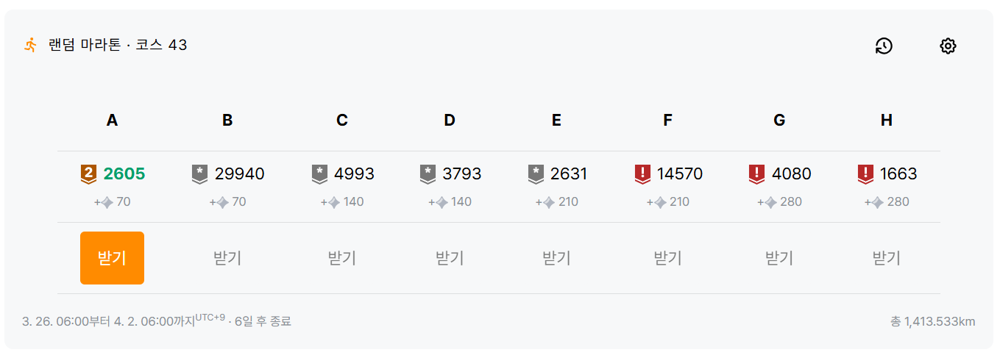
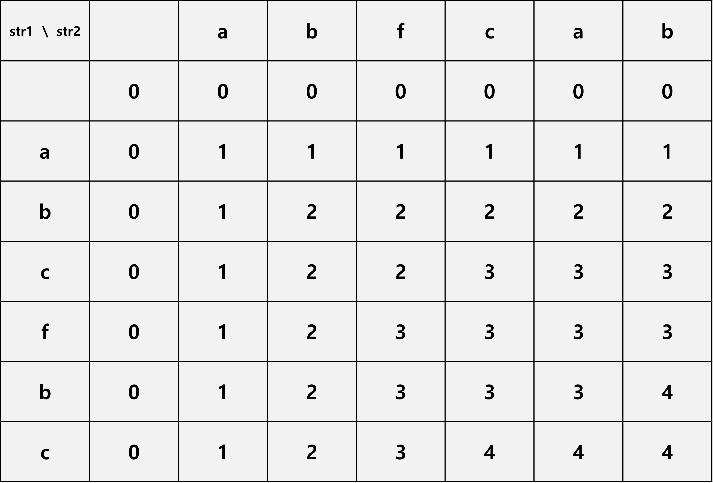

# solved\.ac 랜덤 마라톤 43주차

A번 풀기 전에 캡쳐하지 못해서 A번이 풀렸다고 표시되어있다.  
매우 불편하다.  

---

## A

### #2605 : 줄 세우기
https://www.acmicpc.net/problem/2605

#### 해결 상태
✅

#### 난이도

#### 사용 알고리즘

**#구현**  
**#자료구조**  

#### 풀이

규칙에 따라 대기줄을 재배열한 결과를 출력하는 문제.  

1. 대기줄에 속한 사람의 수 `n`을 입력받는다.
2. `n` 크개의 배열 `rows`를 선언하고, 각각의 원소에 1 ~ `n` 값을 순서대로 저장한다.
3. 각 사람이 뽑은 카드 번호를 `n`번 반복하여 입력받으며 아래 과정을 수행한다.
    - 3-1. 임시 변수 `temp`를 선언하고 이번에 카드를 뽑은 사람 번호(`rows[i]`)를 저장한다.
    - 3-2. `i` 위치를 기준으로 앞 `num`개의 `rows` 배열 원소값을 바로 뒤 쪽 인덱스에 저장하고, `i` 위치를 기준으로 `num`만큼 앞의 원소 위치에 `temp` 변수 값(원래 `num[i]`에 해당하는 사람 번호)를 저장한다.
4. 최종적으로 재배열된 `rows` 배열의 전체 값을 순서대로 출력한다.

#### 코멘트

A번 브론즈 문제 치고는 좀 생각할거리가 많은 문제이다.  
사실 단순 구현에 가까운 문제인데, 언어 별로 제공되는 배열 자료구조 및 함수를 사용하는 방법도 있고 연결리스트를 사용하는 방법도 있고 굉장히 다양한 방식의 풀이가 가능한 것 같다.  
$N$의 범위가 최대 100이기 때문에 어떤 방식을 쓰든 상관없긴 하다.  

처음에 연결리스트를 써야되나 싶었는데 범위 제한을 보고 귀찮아서 O(N^{2}) 방식으로 대충 구현해버렸다.  
삽입 정렬과 유사하게 임시 변수에 카드를 뽑은 사람 번호를 넣은 뒤 카드 번호만큼 앞 사람들을 뒤로 한 칸씩 밀어버리는 방식이다.  
역시 조건만 충족한다면 빠르고 간단하게 짜는게 최고다.

---

## B

### #29940 : Sum
https://www.acmicpc.net/problem/29940

#### 해결 상태
✅

#### 난이도

#### 사용 알고리즘

**#이분 탐색**  
**#두 포인터**  

#### 풀이
주어진 배열 원소 중 정확히 2개의 원소를 더하여 특정 값이 되도록 하는 경우의 수를 구하는 문제.  

1. 입력받을 원소의 수 `n`과 요구되는 원소 합의 값 `s`를 입력받는다.
2. `n` 번에 걸쳐 각 원소의 값을 입력받는다.
3. 두 포인터 연산을 위한 좌측 인덱스 변수 `l`, 우측 인덱스 변수 `r`을 선언하고 각각 0, n - 1로 초기화한다.
4. 조건을 만족하는 경우의 수 개수를 저장할 `cnt` 변수를 선언하고 0으로 초기화한다.
5. 좌쪽 인덱스 `l`과 우측 인덱스 `r`이 만날 때까지 아래 과정을 반복한다.
    - case 1. 만약 `arr[l]`과 `arr[r]`의 합이 `s`보다 작다면 좌측 인덱스 `l`을 1 늘려서 합이 더 커지도록 한다.
    - case 2. 만약 `arr[l]`과 `arr[r]`의 합이 `s`보다 크다면 우측 인덱스 `r`을 1 줄여서 합이 더 작아지도록 한다.
    - case 3. 만약 `arr[l]`과 `arr[r]`의 합이 `s`와 같다면 조건을 만족하는 경우이므로 `cnt` 변수를 1 증가한다. 그리고 다음 경우의 수를 찾기 위해 좌측 인덱스 `l`을 1 늘려서 합이 더 커지도록 한다.
6. `cnt`에 저장된 경우의 수 개수를 출력한다.

#### 코멘트

매우 전형적인 이분 탐색/두 포인터 탐색 문제이다.  
개인적으로 이런 유형의 문제는 두 포인터 풀이가 더 익숙해서 두 포인터 알고리즘을 즐겨 사용한다.  
  
배열 원소도 오름차순으로 입력된다고 보장되어 있어서 별도의 정렬 과정도 필요 없고, 원소 값 범위도 작은 편이라 오버플로우도 고려할 필요 없는 아주 무난한 문제이다.

---

## C

### #4993 : Red and Black
https://www.acmicpc.net/problem/4993

#### 해결 상태
✅

#### 난이도

#### 사용 알고리즘

**#그래프 이론**  
**#그래프 탐색**  
**#너비 우선 탐색**  
**#깊이 우선 탐색**  
  
**#플러드 필**  

#### 풀이

빨간색과 검은색 타일로 이루어진 공간에서 현재 위치 기준으로 연결된 검은색 타일의 개수를 찾는 문제

1. **무한 반복문을 통해 공간의 너비 `w`와 높이 `h`를 입력받아 아래 과정을 수행**한다. **`w`와 `h`가 모두 0이면 반복문을 빠져나가고 프로그램을 종료**한다.
    - 1-1. **시작 지점 높이 위치를 저장할 `sh` 변수와 시작 지점 너비 위치를 저장할 `sw` 변수를 선언**하고, **타일 정보를 저장할 `h` × `w` 크기 bool 타입 2차원 배열 `tiles`를 선언**한다. (false는 빨간색, true는 검은색 타일을 의미하는 것으로 정의한다.)
    - 1-2. **높이 `h` 만큼 반복하며 각 높이 위치(`i`)의 타일 정보를 `str` 문자열로 입력받는다.**
        - 1-2-1. **너비 `w` 만큼 반복하며 이번 높이에서의 각 너비 위치(`j`)의 타일 정보(`str[j]`)를 아래 조건에 따라 저장**한다.
            - case 1. **`str` 문자열의 `j`번째 문자가 '#'이면** 빨간색 타일을 의미하며, **`tiles[i][j]`에 0을 저장**한다.
            - case 2. **`str` 문자열의 `j`번째 문자가 '#'이 아니면** 검은색 타일을 의미하며, **`tiles[i][j]`에 1을 저장**한다. 또한 **`str` 문자열의 `j`번째 문자가 '@'이면,** 시작 지점이므로 **`sh`와 `sw`에 현재 위치 `i`, `j`를 각각 저장**한다.
    - 1-3. **BFS를 수행할 {(높이 위치), (너비 위치)} 쌍의 정수를 저장할 큐 `q`를 선언하고, {`sh`(시작 지점 높이 위치), `sw`(시작 지점 너비 위치)} 쌍을 큐에 추가한 후, `tiles` 배열의 `sh` 높이와 `sw` 너비 위치의 값을 0으로 바꾼다.**(이미 탐색한 위치의 검은색 타일을 빨간색 타일로 변경하여 중복 탐색이 이루어지지 않도록 한다.)
    - 1-4. **이어져 있는 검은색 타일 개수를 저장할 `cnt` 변수를 선언하고** 첫 시작 지점의 검은색 타일부터 시작하는 의미에서 **1로 초기화**한다.
    - 1-5. **큐 `q`가 비기 전까지 아래 과정을 통해 BFS 탐색을 수행**한다.
        - 1-5-1. **큐의 맨 앞 원소(좌표)의 높이 위치를 `nowh`, 너비 위치를 `noww` 변수로 저장하고, 해당 큐 원소를 제거**한다.
        - 1-5-2. 만약 **현재 좌표 위치에서 상단 칸이 검은색 타일(`tiles[nowh - 1][noww]` == 1)이면, `cnt` 변수를 1 증가시키고 해당 위치의 `tiles` 배열 원소를 0(빨간색 타일)으로 바꾼 후, 큐 `q`에 해당 좌표 정보를 추가**한다.
        - 1-5-2. 만약 **현재 좌표 위치에서 좌단 칸이 검은색 타일(`tiles[nowh][noww - 1]` == 1)이면, `cnt` 변수를 1 증가시키고 해당 위치의 `tiles` 배열 원소를 0(빨간색 타일)으로 바꾼 후, 큐 `q`에 해당 좌표 정보를 추가**한다.
        - 1-5-3. 만약 **현재 좌표 위치에서 하단 칸이 검은색 타일(`tiles[nowh + 1][noww]` == 1)이면, `cnt` 변수를 1 증가시키고 해당 위치의 `tiles` 배열 원소를 0(빨간색 타일)으로 바꾼 후, 큐 `q`에 해당 좌표 정보를 추가**한다.
        - 1-5-4. 만약 **현재 좌표 위치에서 우단 칸이 검은색 타일(`tiles[nowh][noww + 1]` == 1)이면, `cnt` 변수를 1 증가시키고 해당 위치의 `tiles` 배열 원소를 0(빨간색 타일)으로 바꾼 후, 큐 `q`에 해당 좌표 정보를 추가**한다.
    - 1-6. **최종 `cnt` 변수**(이어져 있는 검은색 타일의 개수)의 **값을 출력**한다. **이후 1번 과정으로 되돌아간다.**

#### 코멘트 

매우 전형적인 DFS/BFS 플러드 필 탐색 문제이다.  
개인적으로 이런 유형의 문제는 BFS 풀이를 선호하는 편이라 큐를 이용한 BFS 알고리즘을 즐겨 사용한다.  
  
이상한 장애물이나 조건 같은게 없어서 별도로 구현할 부분이 있는 것도 아니고, 원소 값 범위도 작은 편이라 오버플로우도 고려할 필요 없는 아주 무난한 문제이다.  

코멘트 내용이 뭔가 반복된 것 같다면 기분 탓이다.  
어쨌든 날먹날먹 신나는 날먹 BFS 웰논 코드 오늘도 날로 먹는다  

---

## D

### #3793 : Common Subsequence
https://www.acmicpc.net/problem/3793

#### 해결 상태
✅

#### 난이도

#### 사용 알고리즘

**#다이나믹 프로그래밍**  

#### 풀이

주어진 두 문자열의 LCS(최장 공통 부분 수열) 길이를 구하는 문제.

1. 파일 eof를 만나기 전까지 아래 과정을 통해 각 테스트케이스의 LCS 길이를 구한다.
    - 1-1. 두 문자열 `str1`, `str2`를 입력받은 후, `str1`과 `str2`의 문자열 길이를 구해 각각 `size1`, `size2` 변수로 저장한다.
    - 1-2. 두 문자열의 LCS 길이를 저장하기 위한 (`size1` + 1) × (`size2` + 1) 크기의 2차원 DP 배열 `v`를 선언하고 모든 원소를 0으로 초기화한다.
    - 1-3. `str1` 문자열의 각 문자 인덱스를 순회하는 반복 변수 `i`, `str2` 문자열의 각 문자 인덱스를 순회하는 반복 변수 `j`를 이용하여 (`i`, `j`) 쌍을 (1, 1)부터 (`size1`, `size2`)까지 모든 경우를 순회하며 아래 내용을 수행한다.
        - 1-3-1. 만약 `str1`의 `i`번째 인덱스 문자와 `str2`의 `j`번째 인덱스 문자가 똑같은 문자라면 v[`i` - 1][`j` - 1]에 해당하는 문자열의 LCS 길이보다 LCS 길이가 1칸 늘어나므로 v[`i`][`j`]에 해당 v[`i` - 1][`j` - 1] 값에서 1을 더한 값을 저장한다.
        - 1-3-2. 만약 현재 v['i']['j']에 저장된 LCS 길이보다 v[`i` - 1][`j`]에 해당하는 LCS 길이가 크다면 v[`i` - 1][`j`]에 해당하는 LCS 길이를 따르기 위해 해당 값을 v['i']['j']에 저장한다.
        - 1-3-3. 만약 현재 v['i']['j']에 저장된 LCS 길이보다 v[`i`][`j` - 1]에 해당하는 LCS 길이가 크다면 v[`i`][`j` - 1]에 해당하는 LCS 길이를 따르기 위해 해당 값을 v['i']['j']에 저장한다.
    - 1-4. 최종적으로 저장된 v[`size1`][`size2`]의 값을 출력한다. 이 값은 `str1`과 `str2`의 전체 LCS 길이를 나타낸다.

##### 풀이 부록

문제에서 주어진 예제 첫 번째 테스트 케이스의 LCS 길이 DP 테이블은 아래와 같이 구성된다.  

#### 코멘트

매우 전형적인 동적 계획법을 이용한 문자열 LCS 길이 계산 문제이다.  
단순한 2개 문자열 LCS 길이 계산에 EOF 처리만 곁들인 아주 무난한 문제이다.  

다이나믹 프로그래밍으로 LCS 문제를 처음 접했을 때는 발상과 이해가 정말 어려웠었는데  
지금은 이런 LCS 기초 문제 정도는 딱 보자마자 자동으로 코드를 칠 경지에 이르렀다.

오늘도 날먹날먹 신나는 날먹 LCS 웰논 코드 오늘도 날로 먹는다아아  
코멘트 내용이 뭔가 또 반복된 것 같다면 그 또한 기분 탓이다.  

---

## E

### #2631 : 줄세우기
https://www.acmicpc.net/problem/2631

#### 해결 상태
❌

#### 난이도

#### 사용 알고리즘

#### 풀이

#### 코멘트

---

## F

### #14570 : 나무 위의 구슬
https://www.acmicpc.net/problem/14570

#### 해결 상태
❌

#### 난이도

#### 사용 알고리즘

#### 풀이

#### 코멘트

---

## G

### #4080 : Two Ends
https://www.acmicpc.net/problem/4080

#### 해결 상태
❌

#### 난이도

#### 사용 알고리즘

#### 풀이

#### 코멘트
  

---

## H

### #1663 : Two Ends
https://www.acmicpc.net/problem/1663

#### 해결 상태
❌

#### 난이도

#### 사용 알고리즘

#### 풀이

#### 코멘트

---

## 결과 및 후기

| A | B | C | D | E | F | G | H |
|---|---|---|---|---|---|---|---|
| ✅ | ✅ | ✅ | ✅ | ❌ | ❌ | ❌ | ❌ |

